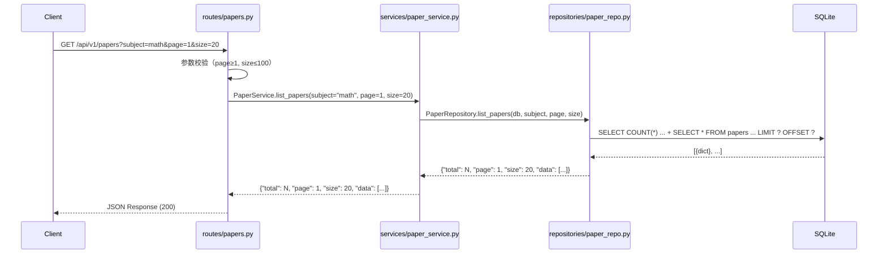
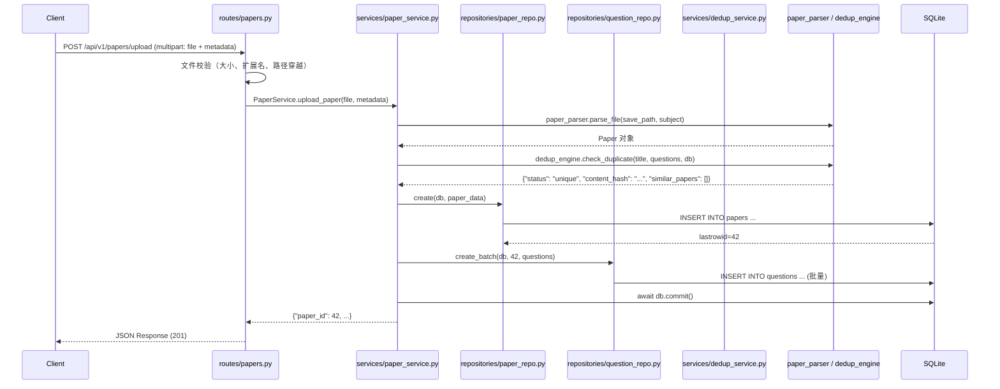
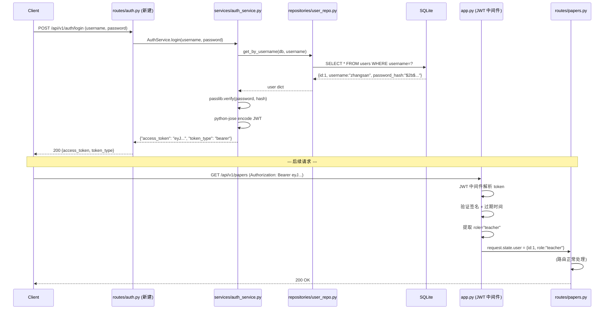
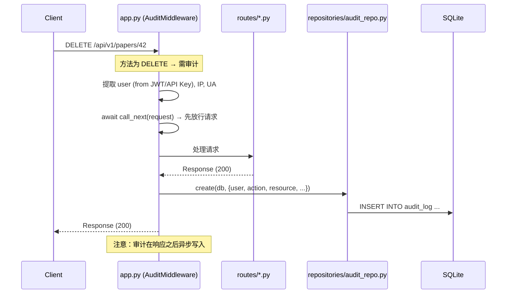
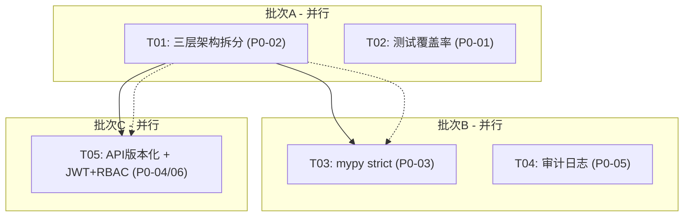

# gaokao-analyzer P0 阶段系统设计 + 任务分解

> **作者**：Bob（Architect）  
> **日期**：2026-07-08  
> **基准版本**：v5.1（`cb39b56`）  
> **设计范围**：P0 六项需求（测试覆盖率 / 三层架构 / mypy strict / API 版本化 / 审计日志 / JWT+RBAC+CORS）

---

## Part A：系统设计

---

### 1. 实现方案

#### 1.1 整体架构变更总览

```
当前 (v5.1)                   目标 (P0 完成后)
┌─────────────┐               ┌─────────────────┐
│  routes/*.py │               │  routes/*.py     │← HTTP 编排 ONLY
│  (裸 SQL +    │               │  (调用 services)  │
│   业务编排)    │               └────────┬────────┘
└──────┬──────┘                           │
       │                              ┌───▼─────────┐
       ▼                              │ services/*    │← 业务编排
  ┌──────────┐                        └───┬─────────┘
  │  engines   │                            │
  │(引擎模块)   │                       ┌───▼─────────┐
  └──────────┘                        │ repositories/*│← DAO (aiosqlite 封装)
                                       └───┬─────────┘
                                           │
                                      ┌────▼────┐
                                      │ SQLite   │
                                      │ (aiosqlite)│
                                      └─────────┘
```

#### 1.2 核心技术挑战与选型

| 挑战 | 方案 | 理由 |
|------|------|------|
| 路由层与 SQL 耦合 | 三层架构（route→service→repository） | 职责分离，可测试性↑，维护性↑ |
| 单 API Key 鉴权 | JWT（python-jose）+ RBAC | 标准 JWT 方案，生态成熟 |
| CORS 通配符 `*` | 环境变量白名单 + 严格来源校验 | OWASP 推荐做法 |
| 无操作审计 | audit_log 表 + 中间件 | 独立于业务，不侵入路由逻辑 |
| mypy 宽松 | `--strict` 模式 + 全仓补注解 | IDE 提示↑，运行时类型错误↓90% |
| 无 API 版本化 | `/api/v1/` 前缀 + 旧路径别名 | 兼容升级，客户端不崩 |

#### 1.3 关键架构决策

##### 决策 1：保持 aiosqlite，不引入 ORM ⭐

**结论：保持 aiosqlite，repositories 层封装所有 SQL。**

理由：
- 当前全仓使用 aiosqlite 裸 SQL，约 15+ 个文件、数百处 SQL 调用
- 引入 SQLAlchemy 2.0 需全面改写 DB 层 → 工作量巨大，风险高
- 通过 repositories 层封装后，SQL 集中管理，未来迁移 ORM 时只需替换 repositories 内部实现
- 保持与现有 `get_db` 依赖注入体系一致

##### 决策 2：Repository 返回类型为 plain dict

- 与当前 `execute_fetchone`/`execute_fetchall` 返回 `dict` 一致
- 不引入新的 dataclass/pydantic 模型层（避免过度抽象）
- 保持与现有路由代码兼容

##### 决策 3：服务层错误使用异常

- 业务异常继续使用 `HTTPException`
- 增加自定义业务异常层次：`NotFoundError`、`DuplicateError`、`PermissionDeniedError`
- 服务层抛出业务异常，路由层捕获并转换为 HTTP 响应

##### 决策 4：事务管理由 Service 层负责

- Service 方法接收 `db` 参数，在方法内部执行 `await db.commit()`
- 不再在路由层 `commit()` — 路由层只调用 service，不直接操作 DB
- 批量操作中需保持事务原子性

##### 决策 5：JWT 选用 python-jose[cryptography] + passlib[bcrypt]

| 库 | 用途 | 理由 |
|----|------|------|
| `python-jose[cryptography]` | JWT 签发/验证 | FastAPI 生态最主流，文档完善 |
| `passlib[bcrypt]` | 密码哈希 | bcrypt 为密码存储工业标准 |
| `python-multipart` | 注册/登录表单 | FastAPI OAuth2 密码流需要 |

##### 决策 6：RBAC 角色模型

```
admin   → 所有操作（用户管理、系统配置、数据删除）
teacher → 试卷 CRUD、分析、搜索、查看报告
viewer  → 仅查看（搜索、查看报告、下载）
```

- 角色存储在 `roles` 表 + `user_roles` 关联表
- JWT payload 中携带 `role` + `user_id`
- 装饰器/Dependency 做角色校验

##### 决策 7：API Key 兼容模式

- JWT 上线后，现有 `AuthMiddleware` 改造为检查 `Authorization: Bearer <API_KEY>` 或 `Authorization: Bearer <JWT>`
- API Key 校验通过 → 视为 `admin` 角色（保持现有行为）
- 两种认证方式共存，静默降级

##### 决策 8：审计日志中间件

- 使用 `@app.middleware("http")` 或 Starlette `BaseHTTPMiddleware`
- 仅拦截 `POST/PUT/DELETE` 方法
- 异步插入 `audit_log` 表（不阻塞响应）
- 从 JWT payload 或 API Key 中提取 `user` 信息
- 与现有 `verification_audit` 表（试卷真实性审核）完全独立

---

### 2. 文件列表

#### 2.1 新增文件

```
repositories/__init__.py         # 包导出
repositories/paper_repo.py       # papers 表 DAO
repositories/question_repo.py    # questions 表 DAO
repositories/analysis_repo.py    # analysis_results 表 + paper_reports 表 DAO
repositories/search_repo.py      # FTS5 搜索 DAO
repositories/audit_repo.py       # audit_log 表 DAO
repositories/user_repo.py        # users / roles / user_roles 表 DAO

services/__init__.py             # 包导出
services/paper_service.py        # 试卷 CRUD、上传、删除、筛选、仪表盘
services/analysis_service.py     # IRT 估计、模拟、拟合分析、质量分析
services/search_service.py       # 搜索编排
services/scrape_service.py       # 采集编排（含查重落库）
services/audit_service.py        # 审计日志写入
services/auth_service.py         # JWT 签发/验证、用户注册/登录、角色校验
services/filter_service.py       # 筛选元数据
services/dedup_service.py        # 查重编排

tests/test_paper_analysis.py     # paper_analysis 模块测试（约 8 个）
tests/test_scraper.py            # scraper 模块测试（约 6 个）
tests/test_search.py             # search 模块测试（约 6 个）
tests/test_irt.py                # IRT 模型测试（约 6 个）
tests/test_simulator.py          # 模拟器测试（约 4 个）
tests/test_audit_log.py          # 审计日志测试（约 4 个）
tests/test_auth.py               # JWT+RBAC 测试（约 6 个）
```

#### 2.2 修改文件

```
app.py                           # 路由 prefix、审计中间件、JWT 中间件、CORS 白名单
config.py                        # JWT 配置、CORS 严格配置
models.py                        # audit_log 表 schema、users/roles/user_roles 表 schema
deps.py                          # 新增 service 依赖、认证依赖
lifespan.py                      # 注册新的 engine/service 依赖（如需）
pyproject.toml                   # mypy --strict 配置
routes/papers.py                 # 抽离 SQL + 业务 → repositories + services
routes/search.py                 # 同上
routes/analysis.py               # 同上
routes/audit.py                  # 同上
routes/dedup.py                  # 同上
routes/scrape.py                 # 同上
routes/official_docs.py          # 同上（保持调用服务模式）
static/index.html                # API 路径更新 /api/ → /api/v1/
```

#### 2.3 文件职责矩阵

| 文件 | P0-01 测试 | P0-02 三层 | P0-03 mypy | P0-04 版本化 | P0-05 审计 | P0-06 JWT |
|------|:---------:|:---------:|:---------:|:----------:|:---------:|:--------:|
| `repositories/` (新建) | | ✓ | | | | ✓ |
| `services/` (新建) | | ✓ | | | ✓ | ✓ |
| `models.py` | | | ✓ | | ✓ | ✓ |
| `config.py` | | | ✓ | | ✓ | ✓ |
| `app.py` | | ✓ | ✓ | ✓ | ✓ | ✓ |
| `deps.py` | | ✓ | ✓ | | | ✓ |
| `routes/*.py` (7个) | | ✓ | ✓ | ✓ | | |
| `paper_analysis.py` | ✓ | | ✓ | | | |
| `scraper.py` | ✓ | | ✓ | | | |
| `search.py` | ✓ | | ✓ | | | |
| `analyzer.py` | ✓ | | ✓ | | | |
| `simulator.py` | ✓ | | ✓ | | | |
| `pyproject.toml` | | | ✓ | | | |
| `static/index.html` | | | | ✓ | | |
| `tests/` (扩展/新建) | ✓ | | | | ✓ | ✓ |

---

### 3. 数据结构和接口设计

#### 3.1 类图

```mermaid
classDiagram
    %% ========== Repository Interfaces ==========
    class PaperRepository {
        +list_papers(db, filters, page, size) dict
        +get_by_id(db, paper_id) dict | None
        +create(db, data) int
        +delete(db, paper_id) None
        +update_status(db, paper_id, status) None
        +get_dashboard_stats(db) dict
        +get_filter_options(db) dict
        +get_latest_papers(db, limit) list[dict]
    }
    class QuestionRepository {
        +list_by_paper(db, paper_id) list[dict]
        +create_batch(db, paper_id, questions) None
        +update_irt(db, q_id, a, b, c, disc) None
        +update_quality(db, q_id, rating, is_quality) None
        +update_cognitive(db, q_id, cognitive, competency) None
        +get_quality_questions(db, filters) list[dict]
    }
    class AnalysisRepository {
        +get_by_paper(db, paper_id) list[dict]
        +create(db, data) int
        +get_report(db, paper_id) dict | None
        +save_report(db, paper_id, report_json, score, grade) None
    }
    class SearchRepository {
        +search_papers_fts(db, q, filters, sort, page, size) dict
        +search_questions_fts(db, q, filters, page, size) dict
        +suggest(db, q, limit) list[str]
    }
    class AuditRepository {
        +create(db, audit_entry) int
        +list_by_user(db, user, limit) list[dict]
        +list_recent(db, limit) list[dict]
    }
    class UserRepository {
        +get_by_username(db, username) dict | None
        +get_by_id(db, user_id) dict | None
        +create(db, user_data) int
        +get_roles(db) list[dict]
        +get_user_roles(db, user_id) list[str]
    }

    %% ========== Service Interfaces ==========
    class PaperService {
        +list_papers(filters, page, size) dict
        +get_paper(paper_id) dict
        +delete_paper(paper_id) dict
        +upload_paper(file, metadata) dict
        +get_filters() dict
        +get_dashboard() dict
    }
    class AnalysisService {
        +estimate_irt(paper_id, n_students) dict
        +run_simulation(paper_id, n_students) dict
        +fit_analysis(sim_id, ref_id, subject) dict
        +analyze_curriculum(paper_id) dict
        +analyze_quality(paper_id) dict
        +full_analyze(paper_id) dict
        +batch_analyze(paper_ids) dict
        +batch_estimate_irt(filters) dict
        +batch_simulate(filters) dict
    }
    class AuthService {
        +register(username, password, role) dict
        +login(username, password) dict
        +verify_token(token) dict
        +get_current_user(token) dict
        +require_role(token, required_role) bool
    }
    class AuditService {
        +log(action, resource_type, resource_id, user, ip, ua, detail) None
        +get_user_logs(user, limit) list[dict]
    }

    %% ========== Data Models ==========
    class AuditLogEntry {
        +int id
        +str user
        +str action
        +str resource_type
        +str resource_id
        +str ip_address
        +str user_agent
        +str detail
        +str created_at
    }
    class User {
        +int id
        +str username
        +str password_hash
        +str email
        +bool is_active
        +str created_at
    }
    class Role {
        +str id
        +str name
        +str description
    }
    class UserRole {
        +int user_id
        +str role_id
    }
    class JwtPayload {
        +int sub (user_id)
        +str username
        +str role
        +str tenant_id (预留)
        +int exp
        +int iat
    }

    %% Relationships
    PaperRepository --> QuestionRepository : uses
    PaperRepository --> AnalysisRepository : uses
    PaperService --> PaperRepository
    PaperService --> QuestionRepository
    PaperService --> AnalysisRepository
    AnalysisService --> AnalysisRepository
    AnalysisService --> QuestionRepository
    AnalysisService --> PaperRepository
    AuthService --> UserRepository
    AuditService --> AuditRepository
    SearchRepository ..> papers_fts : FTS5 query
    User --> UserRole : has
    Role --> UserRole : assigned to
    JwtPayload ..> User : encodes
```



#### 3.2 数据库 Schema 变更

##### audit_log 表（新增）

```sql
CREATE TABLE IF NOT EXISTS audit_log (
    id INTEGER PRIMARY KEY AUTOINCREMENT,
    user TEXT NOT NULL DEFAULT 'anonymous',
    action TEXT NOT NULL,              -- POST / PUT / DELETE
    resource_type TEXT NOT NULL,        -- e.g. 'paper', 'analysis', 'user'
    resource_id TEXT,                   -- 被操作资源的 ID（字符串兼容）
    ip_address TEXT,
    user_agent TEXT,
    detail TEXT,                        -- JSON 格式的额外上下文
    created_at TIMESTAMP DEFAULT CURRENT_TIMESTAMP
);
CREATE INDEX IF NOT EXISTS idx_audit_log_user ON audit_log(user);
CREATE INDEX IF NOT EXISTS idx_audit_log_resource ON audit_log(resource_type, resource_id);
CREATE INDEX IF NOT EXISTS idx_audit_log_created ON audit_log(created_at);
```

##### users 表（新增）

```sql
CREATE TABLE IF NOT EXISTS users (
    id INTEGER PRIMARY KEY AUTOINCREMENT,
    username TEXT UNIQUE NOT NULL,
    password_hash TEXT NOT NULL,
    email TEXT,
    is_active INTEGER NOT NULL DEFAULT 1,
    created_at TIMESTAMP DEFAULT CURRENT_TIMESTAMP,
    updated_at TIMESTAMP DEFAULT CURRENT_TIMESTAMP
);
```

##### roles 表（新增）

```sql
CREATE TABLE IF NOT EXISTS roles (
    id TEXT PRIMARY KEY,               -- 'admin', 'teacher', 'viewer'
    name TEXT NOT NULL,                 -- '管理员', '教师', '查看者'
    description TEXT,
    priority INTEGER DEFAULT 0         -- 数字越小权限越高
);
INSERT OR IGNORE INTO roles (id, name, description, priority) VALUES
    ('admin', '管理员', '系统管理员，拥有所有权限', 0),
    ('teacher', '教师', '可以上传、分析、查看试卷', 1),
    ('viewer', '查看者', '仅可查看和搜索', 2);
```

##### user_roles 关联表（新增）

```sql
CREATE TABLE IF NOT EXISTS user_roles (
    user_id INTEGER NOT NULL,
    role_id TEXT NOT NULL,
    assigned_at TIMESTAMP DEFAULT CURRENT_TIMESTAMP,
    PRIMARY KEY (user_id, role_id),
    FOREIGN KEY (user_id) REFERENCES users(id) ON DELETE CASCADE,
    FOREIGN KEY (role_id) REFERENCES roles(id) ON DELETE CASCADE
);
```

#### 3.3 Repository 接口详细定义

**PaperRepository** — 文件路径：`repositories/paper_repo.py`

| 方法 | 签名 | 返回 |
|------|------|------|
| `list_papers` | `(db, subject, paper_type, year, province, analysis_status, page, size) -> dict` | `{total, page, size, data: [dict]}` |
| `get_by_id` | `(db, paper_id) -> dict \| None` | 试卷行 |
| `create` | `(db, data: dict) -> int` | lastrowid |
| `delete` | `(db, paper_id) -> None` | — |
| `update_status` | `(db, paper_id, status) -> None` | — |
| `update_analysis` | `(db, paper_id, field, value) -> None` | — |
| `get_for_analysis` | `(db, paper_id) -> dict \| None` | 含 subject_id |
| `get_dashboard_stats` | `(db) -> dict` | 各类 count |
| `get_filter_options` | `(db) -> dict` | provinces, tags 等 |
| `get_latest` | `(db, limit) -> list[dict]` | 最新试卷列表 |
| `list_pending_irt` | `(db, subject, paper_type, limit) -> list[int]` | paper_id 列表 |

**QuestionRepository** — 文件路径：`repositories/question_repo.py`

| 方法 | 签名 | 返回 |
|------|------|------|
| `list_by_paper` | `(db, paper_id) -> list[dict]` | 排序后的题目列表 |
| `create_batch` | `(db, paper_id, questions: list[dict]) -> None` | — |
| `update_irt` | `(db, q_id, a, b, c, disc) -> None` | — |
| `update_quality` | `(db, q_id, rating, is_quality) -> None` | — |
| `update_cognitive` | `(db, q_id, cognitive, competency) -> None` | — |
| `get_quality_questions` | `(db, subject, q_type, min_score, limit) -> list[dict]` | — |
| `get_by_paper_ids` | `(db, paper_ids) -> dict[int, list[dict]]` | paper_id→questions |

**AnalysisRepository** — 文件路径：`repositories/analysis_repo.py`

| 方法 | 签名 | 返回 |
|------|------|------|
| `get_by_paper` | `(db, paper_id) -> list[dict]` | 分析结果列表 |
| `create` | `(db, data: dict) -> int` | — |
| `save_report` | `(db, paper_id, report_json, score, grade) -> None` | — |
| `get_report` | `(db, paper_id) -> dict \| None` | 最新报告 |

**SearchRepository** — 文件路径：`repositories/search_repo.py`

| 方法 | 签名 | 返回 |
|------|------|------|
| `search_papers` | `(db, q, filters, sort, page, size) -> dict` | `{total, data}` |
| `search_questions` | `(db, q, filters, page, size) -> dict` | `{total, data}` |
| `suggest` | `(db, q, limit) -> list[str]` | 补全建议 |

**AuditRepository** — 文件路径：`repositories/audit_repo.py`

| 方法 | 签名 | 返回 |
|------|------|------|
| `create` | `(db, entry: dict) -> int` | — |
| `list_recent` | `(db, limit) -> list[dict]` | — |

**UserRepository** — 文件路径：`repositories/user_repo.py`

| 方法 | 签名 | 返回 |
|------|------|------|
| `get_by_username` | `(db, username) -> dict \| None` | — |
| `get_by_id` | `(db, user_id) -> dict \| None` | — |
| `create` | `(db, username, password_hash, email) -> int` | — |
| `get_roles` | `(db) -> list[dict]` | 所有角色 |
| `get_user_role_ids` | `(db, user_id) -> list[str]` | role id 列表 |
| `assign_role` | `(db, user_id, role_id) -> None` | — |

#### 3.4 JWT Payload 结构

```python
# JWT Token Payload
{
    "sub": 1,                           # user_id
    "username": "zhangsan",
    "role": "teacher",                   # primary role (admin/teacher/viewer)
    "scopes": ["papers:read", "papers:write", "analysis:run"],  # 权限列表
    "exp": 1710000000,                   # 过期时间
    "iat": 1709913600,                   # 签发时间
    "iss": "gaokao-analyzer",           # 签发者
}

# API Key 兼容 → JWT 映射
# API Key 用户 -> sub=0, role="admin", username="api-key-user"
```

#### 3.5 CORS 白名单配置

```python
# config.py 新增
# 从环境变量读取严格 CORS 来源列表
# 格式：逗号分隔的 URL 列表
# 示例：CORS_ORIGINS="https://example.com,https://admin.example.com"
# 默认：空字符串（仅允许同源请求）
CORS_ORIGINS_STRICT = os.environ.get("CORS_ORIGINS", "")
# 若未设置则回退到 ["*"] 保持兼容（但会日志警告）
```

---

### 4. 程序调用流程

#### 4.1 三层架构 — 试卷列表查询（典型读操作）



#### 4.2 三层架构 — 试卷上传（典型写操作）



#### 4.3 JWT 登录 + RBAC 校验



#### 4.4 审计日志中间件



---

### 5. 待明确事项

| # | 问题 | 当前假设 |
|---|------|---------|
| 1 | `routes/papers.py`（800+行）是否批量拆 service 还是一个路由一个路由拆？ | 建议先拆 papers.py 为示例，其他路由按模式复制。papers.py 拆为 `PaperService` + `AnalysisService` 两个 service。 |
| 2 | 关于 `routes/audit.py` 中的「audit」命名冲突处理 | 当前 `routes/audit.py` 是试卷真实性审核。P0-05 的「操作审计日志」放在 `services/audit_service.py` + `middleware`，不另开路由文件以避免混淆。也可重命名 `routes/audit.py` → `routes/verification.py`。**建议 P0-02 时就重命名**。 |
| 3 | 审计日志是同步写还是异步（不阻塞响应）？ | **推荐异步写**：中间件先 `await call_next(request)` 拿到响应后再写 audit_log。如果写失败仅记录日志警告，不阻塞响应返回。 |
| 4 | JWT 过期时间多少合适？ | 默认 24 小时，配置文件可调。 |
| 5 | `routes/official_docs.py` 已经通过 `official_docs.search_docs()` 封装了引擎调用，是否也需要拆 service/repo？ | official_docs 引擎自身已有内部查询，但为了统一模式，建议也加 `services/official_docs_service.py` 和 `repositories/official_docs_repo.py`。但 P0 受限工作量可暂缓 — **不作为 P0 强制要求**。 |
| 6 | P0-03 mypy strict 是否包括 `static/index.html`（非 Python 文件）？ | **不包括**。仅限 Python 源文件。 |
| 7 | pytest-cov 当前是否在 dev 依赖中？ | 当前 `requirements-dev.txt` 仅有 `pytest`、`pytest-asyncio`。需添加 `pytest-cov` 到 dev 依赖。 |

---

## Part B：任务分解

---

### 6. 新增依赖包

```txt
# requirements.txt — 运行时依赖（新增）
python-jose[cryptography]>=3.3.0    # JWT 签发/验证
passlib[bcrypt]>=1.7.4              # 密码哈希
python-multipart>=0.0.9             # 表单解析（注册/登录）

# requirements-dev.txt — 开发/CI 依赖（新增）
pytest-cov>=5.0.0                   # 覆盖率报告
```

> **检查**：`mypy` 已在 `requirements-dev.txt` 中（`mypy>=1.11.2`），无需添加。
> **检查**：`pytest-asyncio` 已在 `requirements-dev.txt` 中，无需添加。

---

### 7. 任务列表（5 个任务，按 3 个执行批次）

#### 批次 A：基础架构重构 + 测试 ⬅️ 建议两个工程师并行

---

##### T01：三层架构拆分（P0-02）

| 字段 | 内容 |
|------|------|
| **Task ID** | T01 |
| **Task Name** | 三层架构拆分 — repositories + services + routes 瘦身 |
| **批次** | 批次 A |
| **优先级** | P0 |
| **预估工作量** | 2–3 人天 |
| **验收要点** | • `routes/*.py` 中无直接 `db.execute()` / `db.execute_fetchall()`<br>• 所有 DB 操作通过 repositories 方法完成<br>• 所有业务编排通过 services 方法完成<br>• `pytest` 全部通过<br>• 不影响现有功能 |
| **依赖** | 无（可独立进行） |

**涉及文件（共 22 个）**：

**新建（14 个）**：
- `repositories/__init__.py`
- `repositories/paper_repo.py`
- `repositories/question_repo.py`
- `repositories/analysis_repo.py`
- `repositories/search_repo.py`
- `services/__init__.py`
- `services/paper_service.py`
- `services/analysis_service.py`
- `services/search_service.py`
- `services/scrape_service.py`
- `services/filter_service.py`
- `services/dedup_service.py`

**修改（8 个）**：
- `routes/papers.py`（移除裸 SQL + 业务编排，调用 services）
- `routes/search.py`（同上）
- `routes/analysis.py`（同上）
- `routes/audit.py`（同上 + 考虑重命名为 `routes/verification.py`）
- `routes/dedup.py`（同上）
- `routes/scrape.py`（同上）
- `routes/official_docs.py`（同上）
- `deps.py`（注册 service 依赖）
- `app.py`（注册新依赖）
- `lifespan.py`（如需注册新的 service 依赖）

> 注：`routes/official_docs.py` 已通过引擎封装，可暂缓改造仅做最小改动。**关键是 papers.py（800+行）必须完全拆分。**

---

##### T02：测试覆盖率提升到 50%+（P0-01）

| 字段 | 内容 |
|------|------|
| **Task ID** | T02 |
| **Task Name** | 测试覆盖率提升 — 5 个核心模块 ≥ 40 个测试函数 + 行覆盖率 ≥ 50% |
| **批次** | 批次 A |
| **优先级** | P0 |
| **预估工作量** | 1.5–2 人天 |
| **验收要点** | • `pytest --cov=paper_analysis,scraper,search,analyzer,simulator --cov-report=term-missing` 行覆盖率 ≥ 50%<br>• 总测试函数从 15 → ≥ 40<br>• 覆盖正常路径、边界值、空输入、异常路径 |
| **依赖** | 无（可与 T01 并行） |

**涉及文件（共 11 个）**：

**新建（5 个）**：
- `tests/test_paper_analysis.py`
- `tests/test_scraper.py`
- `tests/test_search.py`
- `tests/test_irt.py`
- `tests/test_simulator.py`

**修改（6 个）**：
- `tests/test_analysis.py`（扩展已有测试）
- `requirements-dev.txt`（加 `pytest-cov>=5.0.0`）
- `.github/workflows/ci.yml`（添加 `--cov` 参数）
- `paper_analysis.py`（如需调整可测试性，最小改动）
- `scraper.py`（同上）
- `search.py`（同上）

---

#### 批次 B：类型安全 + 审计日志 ⬅️ 两个任务可并行

---

##### T03：mypy strict 类型注解（P0-03）

| 字段 | 内容 |
|------|------|
| **Task ID** | T03 |
| **Task Name** | mypy strict 类型注解 — 全仓补注解 + pyproject.toml 升级 |
| **批次** | 批次 B |
| **优先级** | P0 |
| **预估工作量** | 1 人天 |
| **验收要点** | • `mypy --strict src/`（不含 tests）零错误<br>• 所有公共函数有完整参数 + 返回类型注解<br>• `pyproject.toml` 中移除 `ignore_missing_imports=true`，`exclude` 保留 `tests` |
| **依赖** | **依赖 T01 完成**（避免因文件重构反复改注解） |

**涉及文件（共 15+ 个）**：

**修改**：
- `pyproject.toml`（`[tool.mypy]` 升级到 strict）
- `app.py`（补注解）
- `config.py`（补注解）
- `models.py`（补注解）
- `deps.py`（补注解）
- `lifespan.py`（补注解）
- `routes/papers.py`（补注解）
- `routes/search.py`（补注解）
- `routes/analysis.py`（补注解）
- `routes/audit.py`（补注解）
- `routes/dedup.py`（补注解）
- `routes/scrape.py`（补注解）
- `routes/official_docs.py`（补注解）
- `services/*.py`（补注解）
- `repositories/*.py`（补注解）
- 其他引擎模块（如需要）

---

##### T04：操作审计日志（P0-05）

| 字段 | 内容 |
|------|------|
| **Task ID** | T04 |
| **Task Name** | 操作审计日志 — audit_log 表 + 中间件 + 配置 |
| **批次** | 批次 B |
| **优先级** | P0 |
| **预估工作量** | 0.5 人天 |
| **验收要点** | • `audit_log` 表创建成功（schema v3）<br>• 每次 POST/PUT/DELETE 请求自动插入一条审计记录<br>• 字段完整：user, action, resource_type, resource_id, ip, timestamp<br>• GET 请求不审计<br>• `pytest` 通过 |
| **依赖** | 无（可独立进行） |

**涉及文件（共 6 个）**：

**新建（1 个）**：
- `repositories/audit_repo.py`

**修改（5 个）**：
- `models.py`（加 `audit_log` 表 schema + migration v3）
- `app.py`（加审计中间件）
- `config.py`（加审计配置：跳过路径）
- `services/audit_service.py`（业务封装）
- `tests/test_audit_log.py`（新建测试）

---

#### 批次 C：API 版本化 + JWT+RBAC ⬅️ 两个任务可并行

---

##### T05：API 版本化（P0-04）+ JWT+RBAC+CORS（P0-06）

| 字段 | 内容 |
|------|------|
| **Task ID** | T05 |
| **Task Name** | API 版本化 + JWT+RBAC 鉴权 + CORS 严格白名单 |
| **批次** | 批次 C |
| **优先级** | P0 |
| **预估工作量** | 2 人天 |
| **验收要点** | • 所有端点可通过 `/api/v1/` 访问<br>• 旧 `/api/` 路径保持兼容（路由别名）<br>• `/api/v1/auth/login` 返回 JWT token<br>• 受保护端点需 `Authorization: Bearer <token>`<br>• CORS 头严格匹配白名单，不再为 `*`<br>• 现有 API Key 可作为兼容模式继续使用<br>• `pytest` 通过 |
| **依赖** | **依赖 T01 完成**（路由稳定后再改 prefix） |

**涉及文件（共 16 个）**：

**新建（4 个）**：
- `services/auth_service.py`
- `repositories/user_repo.py`
- `routes/auth.py`（注册/登录端点）
- `tests/test_auth.py`

**修改（12 个）**：
- `app.py`（所有 `include_router` 加 `prefix="/api/v1"`；替换 `AuthMiddleware`；JWT 中间件；CORS 配置）
- `config.py`（加 `JWT_SECRET`, `JWT_ALGORITHM`, `JWT_EXPIRE_MINUTES`, `CORS_ORIGINS_STRICT`）
- `models.py`（加 `users`, `roles`, `user_roles` 表 schema + migration v4）
- `deps.py`（加 `get_current_user`, `require_role`）
- `routes/papers.py`（更新 prefix）
- `routes/search.py`（更新 prefix）
- `routes/analysis.py`（更新 prefix）
- `routes/audit.py`（更新 prefix）
- `routes/dedup.py`（更新 prefix）
- `routes/scrape.py`（更新 prefix）
- `routes/official_docs.py`（更新 prefix）
- `static/index.html`（API 路径更新 `/api/` → `/api/v1/`）
- `requirements.txt`（加 `python-jose`, `passlib`, `python-multipart`）

---

### 8. 共享知识

#### 8.1 编码规范

1. **Repository 层**：每个方法第一个参数为 `db`（aiosqlite.Connection），返回 `dict` 或 `list[dict]`
2. **Service 层**：方法签名不含 `db` 参数（通过内部函数获取），调用 Repository 方法时传入 `db`
3. **Route 层**：通过 `Depends(get_db)` 获取 `db`，传递给 Service
4. **Service 层负责 `await db.commit()`**，Route 层不再直接 commit
5. **Repository 方法**：方法名统一前缀：`get_*`（单条）、`list_*`（多条）、`create_*`（新增）、`update_*`（修改）、`delete_*`（删除）

#### 8.2 事务管理

```python
# Service 层典型模式
async def upload_paper(self, file, metadata, db):
    paper_id = await PaperRepository.create(db, data)
    await QuestionRepository.create_batch(db, paper_id, questions)
    await db.commit()  # Service 层提交事务
    return {"paper_id": paper_id}
```

#### 8.3 错误处理

- Repository 层：查询不到返回 `None` / `[]`，不抛异常
- Service 层：检查 Repository 返回，若为 `None` 抛 `HTTPException(404, "试卷不存在")`
- Route 层：捕获 Service 异常，不做额外处理
- 自定义异常：`NotFoundError(detail: str)`、`DuplicateError(detail: str)`、`PermissionDeniedError(detail: str)`

#### 8.4 API Key 兼容模式

```python
# AuthMiddleware 改造逻辑
async def dispatch(self, request, call_next):
    auth_header = request.headers.get("Authorization", "")
    if auth_header.startswith("Bearer "):
        token = auth_header[len("Bearer "):]
        # 1. 尝试 JWT 验证
        try:
            payload = jwt.decode(token, SECRET, algorithms=[ALGORITHM])
            request.state.user = payload
        except JWTError:
            # 2. 回退到 API Key 验证
            if token == API_KEY:
                request.state.user = {"id": 0, "role": "admin", "username": "api-key-user"}
            else:
                return JSONResponse(401, {"detail": "无效的认证令牌"})
    return await call_next(request)
```

#### 8.5 JWT 配置

```python
# config.py
JWT_SECRET = os.environ.get("JWT_SECRET", "change-me-in-production")
JWT_ALGORITHM = "HS256"
JWT_EXPIRE_MINUTES = int(os.environ.get("JWT_EXPIRE_MINUTES", "1440"))  # 24h
```

#### 8.6 CORS 配置

```python
# app.py — 替换当前 CORS 中间件配置
cors_origins = os.environ.get("CORS_ORIGINS", "")
if cors_origins:
    origins = [o.strip() for o in cors_origins.split(",") if o.strip()]
else:
    origins = ["*"]
    logger.warning("CORS_ORIGINS 未设置，使用通配符 '*' — 生产环境请设置严格白名单")
app.add_middleware(CORSMiddleware, allow_origins=origins, ...)
```

#### 8.7 测试规范

- 所有测试文件放置在 `tests/` 目录下
- 使用 `fastapi.testclient.TestClient` 进行集成测试
- 单元测试直接调用模块函数（不启动 HTTP）
- 覆盖率测试：`pytest --cov=paper_analysis,scraper,search,analyzer,simulator --cov-report=term-missing`
- 禁用网络请求的测试（mock 外部依赖）

---

### 9. 任务依赖图



**执行顺序建议**：

```
批次 A ──→ 批次 B ──→ 批次 C
T01 + T02 → T03 + T04 → T05
```

- **批次 A**：T01（三层架构）和 T02（测试）可分配给两位工程师并行
- **批次 B**：T03 依赖 T01（三层架构稳定后再加 mypy 注解）；T04 独立可并行
- **批次 C**：T05 依赖 T01（路由稳定后再改 prefix + 加鉴权）
