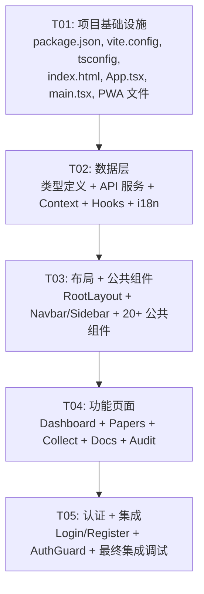

# gaokao-analyzer 前端重写 — 架构设计方案

> **架构师**: Bob  
> **时间**: 2026-07  
> **技术栈**: Vite + React 18+ + TypeScript (strict) + MUI v6 + Tailwind CSS + React Router v7 + ECharts + Axios + React Context

---

## Part A: System Design

### 1. Implementation Approach

#### 核心技术挑战分析

| 挑战 | 说明 | 解决方案 |
|------|------|----------|
| **单文件拆解** | 现有 2039 行 SPA 含完整 CSS/HTML/JS，需分解为组件树 | 按页面功能垂直拆分，共享组件水平抽取 |
| **12+ 个独立页面** | 仪表盘、试卷列表/详情/分析、采集、文件库、审核、认证等 | React Router v7 集中路由，懒加载页面组件 |
| **JWT 认证贯穿** | 所有 API 请求需携带 token，需统一管理认证态 | React Context + Axios 拦截器，统一处理 401 自动登出 |
| **i18n 国际化** | 中英文切换，现有 JSON 翻译文件可复用 | React Context 封装 `t()`，构建时内联 JSON |
| **ECharts 迁移** | 原 Chart.js 图表需迁移至 ECharts | 封装 `ChartView` 组件，统一管理实例创建/销毁 |
| **PWA 支持** | manifest.json + sw.js 需保留 | `vite-plugin-pwa` 自动生成 |
| **复杂筛选/搜索** | 多维度筛选 + 联想搜索 + 分页 | 受控表单组件 + debounce + URL search params 同步 |

#### 框架选型及理由

| 选型 | 版本 | 理由 |
|------|------|------|
| **Vite** | ^6.x | 极速 HMR，原生 ESM，TypeScript 开箱支持 |
| **React** | ^18.3 | 组件化 UI，Hooks 生态，团队熟悉度高 |
| **TypeScript** | ^5.x strict | 类型安全，减少运行时错误 |
| **MUI** | ^6.x | 高质量 Material Design 组件，响应式，主题系统 |
| **Tailwind CSS** | ^4.x | 原子化 CSS，与 MUI 互补，快速样式开发 |
| **React Router** | ^7.x | SPA 路由，嵌套路由，loaders，懒加载 |
| **ECharts** | ^5.x | 丰富图表类型，性能好，适合分析报告场景 |
| **Axios** | ^1.x | 拦截器机制非常适合 JWT 认证管理 |
| **React Context** | 内置 | 轻量全局状态管理，够用 |

#### 架构模式

```
Pages (页面层)
  ↓ 调用
Services (API 服务层 - Axios)
  ↓ 请求
API Client (Axios 实例 + 拦截器)
  ↓ HTTP
FastAPI Backend (现有后端)

Contexts (全局状态层)
  ├── AuthContext    → 认证状态 + token 管理
  ├── I18nContext    → 国际化 + 翻译函数
  └── ThemeContext   → MUI 主题切换 (预留)

Components (组件层)
  ├── Layout    → Navbar, Sidebar, BottomNav
  ├── Common    → PaperCard, StatCard, ChartView, Pagination, Toast...
  └── States    → LoadingState, EmptyState, ErrorState
```

---

### 2. 文件列表 (Directory Tree)

```
frontend/
├── index.html                    # Vite 入口 HTML
├── package.json                  # 依赖声明 + 脚本
├── tsconfig.json                 # TypeScript strict 配置
├── tsconfig.node.json            # Vite 配置的 TS 编译
├── vite.config.ts                # Vite 配置 (proxy, PWA plugin)
├── tailwind.config.ts            # Tailwind CSS 配置
├── postcss.config.js             # PostCSS 配置
├── public/
│   ├── manifest.json             # PWA manifest
│   ├── sw.js                     # Service Worker (Network First)
│   ├── icon-192.png              # PWA 图标
│   └── icon-512.png              # PWA 图标
│
└── src/
    ├── main.tsx                  # React 入口，Provider 嵌套
    ├── App.tsx                   # Router 配置，全局布局
    ├── vite-env.d.ts             # Vite 类型声明
    │
    ├── types/
    │   ├── index.ts              # 所有类型定义 (Paper, Question, Analysis 等)
    │   ├── api.ts                # API 请求/响应类型
    │   └── i18n.d.ts             # 翻译键类型 (type-safe keys)
    │
    ├── constants/
    │   └── index.ts              # 常量: 科目映射, 类型标签, 状态映射, 科目列表
    │
    ├── i18n/
    │   ├── zh.json               # 中文翻译 (复用 locales/zh.json)
    │   ├── en.json               # 英文翻译 (复用 locales/en.json)
    │   └── index.ts              # i18n 配置导出
    │
    ├── contexts/
    │   ├── AuthContext.tsx        # JWT 认证管理
    │   ├── I18nContext.tsx        # 国际化上下文
    │   └── ThemeContext.tsx       # MUI 主题配置 (light/dark 预留)
    │
    ├── services/
    │   ├── api.ts                # Axios 实例 (baseURL, 拦截器)
    │   ├── auth.ts               # AuthService: login, register
    │   ├── paper.ts              # PaperService: CRUD + IRT + 模拟 + 分析
    │   ├── search.ts             # SearchService: 搜索 + 联想
    │   ├── dashboard.ts          # DashboardService: 仪表盘统计
    │   ├── filter.ts             # FilterService: 筛选元数据
    │   ├── collect.ts            # CollectService: 采集
    │   ├── doc.ts                # DocService: 官方文件库
    │   ├── audit.ts              # AuditService: 真实性审核
    │   └── index.ts              # 统一导出
    │
    ├── hooks/
    │   ├── useAuth.ts            # 认证 Hook (快捷访问 AuthContext)
    │   ├── useI18n.ts            # 国际化 Hook (快捷访问 I18nContext)
    │   ├── useApi.ts             # 通用异步请求 Hook (loading/error/data)
    │   ├── useDebounce.ts        # 防抖 Hook
    │   └── usePagination.ts      # 分页状态 Hook
    │
    ├── layouts/
    │   ├── RootLayout.tsx        # 主布局: Navbar + Sidebar + content + BottomNav
    │   ├── Navbar.tsx            # 顶部导航栏 (品牌 + 搜索 + 操作按钮)
    │   ├── Sidebar.tsx           # 侧边栏导航 (页面链接 + 科目筛选)
    │   ├── BottomNav.tsx         # 移动端底部 Tab 导航
    │   └── AuthLayout.tsx        # 登录/注册页布局 (无侧边栏)
    │
    ├── components/
    │   ├── common/
    │   │   ├── PaperCard.tsx      # 试卷卡片 (列表项)
    │   │   ├── StatCard.tsx       # 统计卡片 (仪表盘)
    │   │   ├── FilterBar.tsx      # 筛选栏 (多维度)
    │   │   ├── Pagination.tsx     # 分页组件
    │   │   ├── QuestionCard.tsx   # 题目卡片 (详情页)
    │   │   ├── ChartView.tsx      # ECharts 图表封装 (创建/销毁/自适应)
    │   │   ├── Toast.tsx          # Toast 通知组件
    │   │   ├── ConfirmDialog.tsx  # 确认对话框 (删除等)
    │   │   └── SearchInput.tsx    # 搜索输入框 (带联想下拉)
    │   ├── states/
    │   │   ├── LoadingState.tsx   # 加载中状态 (骨架屏/旋转)
    │   │   ├── EmptyState.tsx     # 空数据状态
    │   │   └── ErrorState.tsx     # 错误状态 (含重试按钮)
    │   └── analysis/
    │       ├── AnalysisOverview.tsx    # 质量分析概览 (综合得分+维度网格)
    │       ├── AnalysisCharts.tsx      # 分析图表集合 (雷达/柱状/折线)
    │       ├── SimulationMetrics.tsx   # 模拟质量指标 (偏度/峰度等)
    │       └── QualitySummary.tsx      # 质量评估总结
    │
    ├── pages/
    │   ├── dashboard/
    │   │   └── DashboardPage.tsx       # 仪表盘页
    │   ├── papers/
    │   │   ├── PaperListPage.tsx       # 试卷列表页 (含筛选/搜索/分页)
    │   │   ├── PaperDetailPage.tsx     # 试卷详情页 (含所有操作按钮 + 题目 + 图表)
    │   │   └── UploadDialog.tsx        # 上传试卷对话框
    │   ├── collect/
    │   │   └── CollectPage.tsx         # 采集面板页
    │   ├── docs/
    │   │   └── DocsPage.tsx            # 官方文件库页
    │   ├── audit/
    │   │   └── AuditPage.tsx           # 真实性审核页
    │   ├── auth/
    │   │   ├── LoginPage.tsx           # 登录页
    │   │   └── RegisterPage.tsx        # 注册页
    │   └── not-found/
    │       └── NotFoundPage.tsx        # 404 页面
    │
    ├── routes/
    │   └── index.tsx                   # 路由配置 (页面懒加载)
    │
    └── index.css                       # Tailwind 指令 + 全局样式变量 (玻璃态设计)
```

---

### 3. 路由设计

| 路径 | 页面组件 | 权限 | 说明 |
|------|----------|------|------|
| `/` | `DashboardPage` | 需登录 | 仪表盘首页，重定向至 `/dashboard` |
| `/dashboard` | `DashboardPage` | 需登录 | 统计卡片 + 最近试卷 |
| `/papers` | `PaperListPage` | 需登录 | 试卷列表 + 筛选 + 分页 |
| `/papers/:id` | `PaperDetailPage` | 需登录 | 试卷详情 + 题目 + 分析操作 |
| `/collect` | `CollectPage` | 需登录 | 试卷采集面板 |
| `/docs` | `DocsPage` | 需登录 | 官方文件库 |
| `/audit` | `AuditPage` | 需登录 | 真实性审核 |
| `/login` | `LoginPage` | 无需登录 | 登录表单 |
| `/register` | `RegisterPage` | 无需登录 | 注册表单 |
| `*` | `NotFoundPage` | — | 404 页面 |

**路由守卫实现**:
- `AuthContext.isAuthenticated` 控制路由访问
- 未认证用户访问 `/login`、`/register` 外的路由时重定向至 `/login`
- 已认证用户访问 `/login`、`/register` 时重定向至 `/dashboard`
- 使用 React Router v7 的 `loader` + `Navigate` 组件实现

---

### 4. 数据流

#### 4.1 API 请求/响应流程

```
用户操作
  │
  ▼
页面组件 (Pages)
  │ 调用 Service 方法
  ▼
服务层 (Services) — 封装 Axios 请求
  │ 返回 Promise<T>
  ▼
Axios 实例 (api.ts)
  │ 请求拦截器: 自动注入 Authorization: Bearer <token>
  │ 响应拦截器: 401 → AuthContext.logout()
  ▼
FastAPI Backend (/api/v1/*)
  │
  ▼
Axios 解析响应 → 返回类型化数据 → Hook/组件更新状态
```

**API 响应格式约定** (后端现有):
```typescript
// 列表响应
{ data: T[], total: number }

// 对象响应
// 直接返回对象或 { paper, questions, ... }

// 操作响应
{ ok: true } 或 { ok: true, id: number, ... }

// 错误响应
{ detail: string | { msg: string }[] }
```

#### 4.2 认证状态管理

```
┌─────────────────────────────────────────────┐
│                 AuthContext                   │
│  ┌─────────┐  ┌──────────┐  ┌────────────┐  │
│  │  user    │  │  token   │  │ isLoading  │  │
│  └─────────┘  └──────────┘  └────────────┘  │
│  login() register() logout()                 │
│  初始化: 从 localStorage 恢复 token          │
└─────────────────────────────────────────────┘
         │                        │
         ▼                        ▼
    Axios 请求拦截器          Axios 响应拦截器
    自动注入 token           401 → 自动登出
```

**登录/注册流程**:
1. 用户提交表单 → `AuthContext.login/register()`
2. 调用 `AuthService` → POST `/api/v1/auth/login` 或 `/register`
3. 成功后存储 token 到 `localStorage` + 更新 `axios.defaults.headers`
4. 前端跳转到 `/dashboard`

**Token 恢复**:
1. App 启动时 `AuthContext` 尝试从 `localStorage` 读取 token
2. 有 token → 设置到 Axios header → 调用 `GET /api/v1/auth/me` 验证
3. 验证失败 (401) → 清除 token → 用户显示为未认证

#### 4.3 全局状态共享

| 状态 | Context | 存储 | 访问范围 |
|------|---------|------|----------|
| 认证信息 (user, token) | AuthContext | localStorage | 全局 |
| 当前语言 (locale) | I18nContext | localStorage | 全局 |
| 翻译函数 t() | I18nContext | — | 全局 |
| MUI 主题模式 | ThemeContext | localStorage (预留) | 全局 |

**服务层单例管理**: 所有 Service 实例在 `src/services/api.ts` 中创建一次，通过 `import` 共享。

---

### 5. 数据结构和接口 (Class Diagram)

> 详见 `docs/class-diagram.mermaid`

**核心类型定义** (`src/types/index.ts`):

```typescript
// ===== 数据模型 =====
interface Paper {
  id: number;
  title: string;
  subject: string;
  paper_type: string;
  year: number;
  province: string;
  exam_tag: string;
  school: string;
  total_score: number;
  difficulty: number;
  analysis_status: AnalysisStatus;
  verified: boolean;
  question_count: number;
  source_name: string;
  source_priority: string;
  snippet?: string;
}

interface Question {
  id: number;
  paper_id: number;
  q_number: number;
  q_type: 'choice' | 'fill' | 'solve';
  score: number;
  content: string;
  answer: string;
  knowledge_points: string; // JSON string
  quality_rating?: string;
  is_quality: boolean;
  difficulty_param?: number;
  discrimination_param?: number;
  guess_param?: number;
}

interface Analysis {
  id: number;
  paper_id: number;
  analysis_type: string;
  status: string;
  simulation_json: string | null;
  quality_metrics: any;
  created_at: string;
}

interface PaperDetail {
  paper: Paper;
  questions: Question[];
  analyses: Analysis[];
  region_check?: RegionCheck;
  source?: any;
  source_priority_label?: string;
}

interface AnalysisReport {
  composite: { score: number; grade: string; conclusion: string };
  dimensions: Record<string, { score: number; conclusion: string }>;
  visualization: {
    radar?: { dimension: string; score: number }[];
    type_distribution_bar?: { type: string; ratio: number }[];
    knowledge_bar?: { code: string; frequency: number }[];
    difficulty_curve?: { q_index: number; difficulty: number }[];
  };
}

type AnalysisStatus = 'pending' | 'parsed' | 'analyzing' | 'irt_estimated' | 'simulated' | 'analyzed' | 'failed';
```

**服务层接口** (`src/services`):

```typescript
// PaperService
class PaperService {
  list(params: PaperListParams): Promise<{ data: Paper[]; total: number }>;
  getById(id: number): Promise<PaperDetail>;
  delete(id: number): Promise<void>;
  upload(file: File, metadata: PaperUploadMeta): Promise<any>;
  estimateIRT(id: number, nSimStudents?: number): Promise<any>;
  simulate(id: number, nStudents?: number): Promise<any>;
  curriculumAnalysis(id: number): Promise<any>;
  qualityAnalysis(id: number): Promise<any>;
  analyze(id: number): Promise<AnalysisReport>;
  getReport(id: number): Promise<AnalysisReport>;
}

// SearchService
class SearchService {
  search(params: SearchParams): Promise<{ data: Paper[]; total: number }>;
  suggest(q: string): Promise<{ suggestions: string[] }>;
}

// DashboardService
class DashboardService {
  getStats(): Promise<DashboardStats>;
}

// CollectService
class CollectService {
  start(params: CollectParams): Promise<CollectResult>;
  getStatus(): Promise<CollectStatus>;
}

// DocService
class DocService {
  list(params: DocListParams): Promise<{ data: OfficialDoc[] }>;
  refresh(): Promise<any>;
  getCategories(): Promise<Category[]>;
}

// AuditService
class AuditService {
  getSummary(): Promise<AuditSummary>;
  batchAudit(limit?: number): Promise<BatchAuditResult>;
  auditPaper(paperId: number): Promise<AuditResult>;
}
```

---

### 6. Program Call Flow (Sequence Diagram)

> 详见 `docs/sequence-diagram.mermaid`

涵盖六大核心流程的完整调用时序：

1. **认证流程**: 登录 → API 调用 → token 存储 → 跳转
2. **仪表盘加载**: 页面挂载 → API 调用 → 数据渲染
3. **试卷列表 + 筛选**: 筛选条件变更 → 搜索 API → 分页渲染
4. **全局搜索 + 联想**: 输入 → debounce → 联想 API → 选择/回车 → 搜索
5. **试卷详情 + 操作**: IRT/模拟/分析/审核各操作 → POST → 刷新详情
6. **统一错误处理**: Axios 拦截器 401 → 自动登出；其他错误 → Toast

---

### 7. 未确定事项

1. **`/api/v1/search` 端点** — 现有代码使用了 `/api/v1/search` 而非 `/api/v1/papers` 进行列表查询，需确认该端点参数和响应格式是否与现有 `/api/v1/papers` 一致。
2. **`/api/v1/auth/me` 端点** — 现有 index.html 未调用此端点，Token 验证方式需确认（是否存在获取当前用户信息的端点）。
3. **上传 API 响应格式** — `POST /api/v1/papers/upload` 返回的具体字段未在现有代码中完整展示。
4. **PWA 图标文件** — `icon-192.png` 和 `icon-512.png` 需要从后端 `static/` 复制或重新创建。
5. **`/api/v1/search/suggest` 端点** — 响应结构假设为 `{ suggestions: string[] }`，需验证。

**假设**:
- API 所有路径前缀为 `/api/v1/`（兼容 `/api/` 旧路径，但前端统一使用 v1 路径）
- Token 通过 `Authorization: Bearer <token>` 传递
- 响应格式为标准的 JSON，分页接口返回 `{ data: [], total: N }`
- 所有日期使用 ISO 8601 UTC 格式

---

## Part B: Task Decomposition

### 8. 依赖包列表

```json
{
  "dependencies": {
    "react": "^18.3.1",
    "react-dom": "^18.3.1",
    "react-router-dom": "^7.1.0",
    "@mui/material": "^6.4.0",
    "@mui/icons-material": "^6.4.0",
    "@emotion/react": "^11.13.0",
    "@emotion/styled": "^11.13.0",
    "echarts": "^5.5.0",
    "echarts-for-react": "^3.0.0",
    "axios": "^1.7.0",
    "tailwindcss": "^4.0.0"
  },
  "devDependencies": {
    "@types/react": "^18.3.0",
    "@types/react-dom": "^18.3.0",
    "@vitejs/plugin-react": "^4.4.0",
    "typescript": "^5.6.0",
    "vite": "^6.0.0",
    "vite-plugin-pwa": "^0.21.0",
    "postcss": "^8.5.0",
    "@tailwindcss/vite": "^4.0.0"
  }
}
```

### 9. 任务列表 (按依赖顺序)

| 规则 | 要求 |
|------|------|
| 最大任务数 | **5**（硬性上限） |
| 最小粒度 | 每个任务至少 3 个相关文件 |
| 分组原则 | 按功能模块/层次分组 |
| 首个任务 | 项目基础设施 |

---

#### T01: 项目基础设施

| 字段 | 值 |
|------|----|
| **Task ID** | T01 |
| **Task Name** | 项目基础设施搭建 |
| **Priority** | P0 |
| **Dependencies** | 无 |

**创建文件**:
```
frontend/package.json
frontend/tsconfig.json
frontend/tsconfig.node.json
frontend/vite.config.ts
frontend/tailwind.config.ts
frontend/postcss.config.js
frontend/index.html
frontend/public/manifest.json
frontend/public/sw.js
frontend/src/main.tsx
frontend/src/vite-env.d.ts
frontend/src/index.css
frontend/src/App.tsx
```

**职责说明**:
- `package.json`: 所有依赖声明 + 脚本（dev/build/preview）
- `vite.config.ts`: Vite 配置（React 插件, PWA 插件, Tailwind 插件, 开发服务器 proxy `/api/` → `http://localhost:8000`）
- `tsconfig.json`: TypeScript strict 模式配置
- `index.html`: Vite 入口 HTML（MUI 字体加载, PWA meta 标签）
- `public/manifest.json`: PWA manifest（name, icons, theme_color, display）
- `public/sw.js`: Service Worker（Network First for API, Cache First for static）
- `src/main.tsx`: React DOM render + Provider 嵌套（AuthProvider → I18nProvider → ThemeProvider → RouterProvider）
- `src/App.tsx`: 路由挂载入口
- `src/index.css`: Tailwind 指令 `@tailwind base/components/utilities` + CSS 变量（玻璃态设计变量复用原项目）

---

#### T02: 数据层 — 类型定义 + API 服务 + 全局状态

| 字段 | 值 |
|------|----|
| **Task ID** | T02 |
| **Task Name** | 数据层开发（类型 + API 服务 + Context） |
| **Priority** | P0 |
| **Dependencies** | T01 |

**创建文件**:
```
frontend/src/types/index.ts
frontend/src/types/api.ts
frontend/src/types/i18n.d.ts
frontend/src/constants/index.ts
frontend/src/services/api.ts
frontend/src/services/auth.ts
frontend/src/services/paper.ts
frontend/src/services/search.ts
frontend/src/services/dashboard.ts
frontend/src/services/filter.ts
frontend/src/services/collect.ts
frontend/src/services/doc.ts
frontend/src/services/audit.ts
frontend/src/services/index.ts
frontend/src/contexts/AuthContext.tsx
frontend/src/contexts/I18nContext.tsx
frontend/src/contexts/ThemeContext.tsx
frontend/src/hooks/useAuth.ts
frontend/src/hooks/useI18n.ts
frontend/src/hooks/useApi.ts
frontend/src/hooks/useDebounce.ts
frontend/src/hooks/usePagination.ts
frontend/src/i18n/zh.json
frontend/src/i18n/en.json
frontend/src/i18n/index.ts
```

**职责说明**:
- `types/index.ts`: 全部数据接口（Paper, Question, Analysis, DashboardStats 等）
- `types/api.ts`: API 请求参数类型 + 响应类型
- `services/api.ts`: Axios 实例（baseURL = `/api/v1`, 请求拦截器自动注入 JWT, 响应拦截器处理 401/错误）
- `services/paper.ts`: 试卷全操作服务（list, get, delete, upload, IRT, simulate, analyze 等）
- `services/dashboard.ts`: 仪表盘统计服务
- `services/search.ts`: 搜索 + 联想服务
- `services/collect.ts`: 采集面板服务
- `services/doc.ts`: 官方文件库服务
- `services/audit.ts`: 真实性审核服务
- `contexts/AuthContext.tsx`: 认证状态管理（login/register/logout, token localStorage 持久化, axios header 同步）
- `contexts/I18nContext.tsx`: 国际化（locale 切换, t() 翻译函数, 插值参数支持）
- `contexts/ThemeContext.tsx`: MUI 主题（使用原项目 CSS 变量的色彩体系，含亮色模式）
- `hooks/useApi.ts`: 通用异步请求 Hook（状态: idle → loading → success/error）
- `i18n/zh.json` + `i18n/en.json`: 复用现有 locales 翻译文件

---

#### T03: 核心布局 + 公共组件 + 状态组件

| 字段 | 值 |
|------|----|
| **Task ID** | T03 |
| **Task Name** | 布局框架 + 公共组件库 |
| **Priority** | P0 |
| **Dependencies** | T02 |

**创建文件**:
```
frontend/src/layouts/RootLayout.tsx
frontend/src/layouts/Navbar.tsx
frontend/src/layouts/Sidebar.tsx
frontend/src/layouts/BottomNav.tsx
frontend/src/layouts/AuthLayout.tsx
frontend/src/routes/index.tsx
frontend/src/components/common/PaperCard.tsx
frontend/src/components/common/StatCard.tsx
frontend/src/components/common/FilterBar.tsx
frontend/src/components/common/Pagination.tsx
frontend/src/components/common/QuestionCard.tsx
frontend/src/components/common/ChartView.tsx
frontend/src/components/common/Toast.tsx
frontend/src/components/common/ConfirmDialog.tsx
frontend/src/components/common/SearchInput.tsx
frontend/src/components/states/LoadingState.tsx
frontend/src/components/states/EmptyState.tsx
frontend/src/components/states/ErrorState.tsx
```

**职责说明**:
- `RootLayout.tsx`: 主框架布局（Navbar + Sidebar + `<Outlet />` + BottomNav），响应式：桌面显示 Sidebar，移动端显示 BottomNav
- `Navbar.tsx`: 品牌 Logo + 全局搜索输入框（含 SearchInput 联想） + 文件库/采集快捷按钮 + 登录状态（头像/登出）
- `Sidebar.tsx`: 导航菜单（仪表盘/试卷库/采集站/文件库/审核） + 科目快捷筛选
- `BottomNav.tsx`: 移动端底部 Tab（仪表盘/试卷/搜索/设置）
- `AuthLayout.tsx`: 居中卡片布局（登录/注册页用，无侧边栏）
- `routes/index.tsx`: React Router v7 路由配置（页面组件懒加载 `React.lazy`，路由守卫 `AuthGuard`）
- `PaperCard.tsx`: 试卷卡片（标题/高亮/类型/Badge/年份/地区/来源）
- `StatCard.tsx`: 统计卡片（图标/数值/标签/颜色）
- `FilterBar.tsx`: 多维度筛选栏（主题/类型/年份/地区/考试标签/验证状态）
- `Pagination.tsx`: 分页组件（当前页/总数/跳页）
- `QuestionCard.tsx`: 题目卡片（题号/类型/分数/内容/知识点标签/答案）
- `ChartView.tsx`: ECharts 封装（实例创建/销毁/自适应 resize/ReCharts 配置）
- `Toast.tsx`: 通知提示（success/error/info 类型，自动消失）
- `ConfirmDialog.tsx`: MUI Dialog 确认框（删除操作）
- `SearchInput.tsx`: Navbar 搜索框（debounce 输入 → 联想建议下拉）
- `LoadingState.tsx`: 骨架屏 / spinner 状态
- `EmptyState.tsx`: 空数据占位（图标 + 文字 + 提示）
- `ErrorState.tsx`: 错误状态（错误信息 + 重试按钮）

---

#### T04: 页面组件（Dashboard, Papers, Collect, Docs, Audit）

| 字段 | 值 |
|------|----|
| **Task ID** | T04 |
| **Task Name** | 功能页面组件开发 |
| **Priority** | P0 |
| **Dependencies** | T03 |

**创建文件**:
```
frontend/src/pages/dashboard/DashboardPage.tsx
frontend/src/pages/papers/PaperListPage.tsx
frontend/src/pages/papers/PaperDetailPage.tsx
frontend/src/pages/papers/UploadDialog.tsx
frontend/src/pages/collect/CollectPage.tsx
frontend/src/pages/docs/DocsPage.tsx
frontend/src/pages/audit/AuditPage.tsx
frontend/src/pages/not-found/NotFoundPage.tsx
frontend/src/components/analysis/AnalysisOverview.tsx
frontend/src/components/analysis/AnalysisCharts.tsx
frontend/src/components/analysis/SimulationMetrics.tsx
frontend/src/components/analysis/QualitySummary.tsx
```

**职责说明**:
- `DashboardPage.tsx`: 6 个 StatCard（总试卷/已验证/真题/已分析/优质题/文件数）+ 最近试卷列表 PaperCard
- `PaperListPage.tsx`: FilterBar + PaperCard 列表 + Pagination + 清除按钮，调用 SearchService + FilterService
- `PaperDetailPage.tsx`: 返回按钮 + 试卷详情 + 操作按钮行（IRT/模拟/课标/质量/报告/审核）+ 题目列表 QuestionCard + 分析结果图表 ChartView + 分析报告 AnalysisOverview/AnalysisCharts
- `UploadDialog.tsx`: MUI Dialog 上传表单（文件 + 科目/类型/标题/年份/地区）
- `CollectPage.tsx`: 采集表单（年份/科目/关键词） + 采集统计 StatCard + 自动采集状态 + 采集日志表格
- `DocsPage.tsx`: 分类筛选 + 搜索 + 官方文件卡片列表 + 刷新按钮
- `AuditPage.tsx`: 审核统计 StatCard + 批量审核按钮 + 审核结果列表
- `AnalysisOverview.tsx`: 综合质量分（composite-card）+ 六维度网格（dimension-item）
- `AnalysisCharts.tsx`: 4 张 ECharts 图表（雷达/题型分布/知识点覆盖/难度曲线）
- `SimulationMetrics.tsx`: 模拟质量指标卡片（质量评分/偏度/峰度/均值偏差）

---

#### T05: 认证页面 + 路由守卫 + 最终集成

| 字段 | 值 |
|------|----|
| **Task ID** | T05 |
| **Task Name** | 认证页面 + 路由守卫 + 集成调试 |
| **Priority** | P0 |
| **Dependencies** | T04 |

**创建文件**:
```
frontend/src/pages/auth/LoginPage.tsx
frontend/src/pages/auth/RegisterPage.tsx
```

**修改文件**（由前面任务创建，此任务最终修改）:
```
frontend/src/App.tsx                # 集成 AuthGuard 路由守卫
frontend/src/routes/index.tsx       # 添加 AuthGuard + 懒加载
frontend/src/contexts/AuthContext.tsx  # 完善 token 初始化逻辑
```

**职责说明**:
- `LoginPage.tsx`: MUI 表单（用户名 + 密码 + 登录按钮），调用 AuthContext.login()，错误处理（401/验证错误），成功后跳转至 dashboard
- `RegisterPage.tsx`: MUI 表单（用户名 + 密码 + 确认密码 + 邮箱 + 角色选择），调用 AuthContext.register()
- **路由守卫集成**: 在 `routes/index.tsx` 中添加 `<AuthGuard>` 包装器，检查 `AuthContext.isAuthenticated`，未认证重定向至 `/login`
- **Token 初始化验证**: AuthContext 启动时从 localStorage 读 token，设置到 Axios header，尝试调用 `/api/v1/subjects` 或 `/api/v1/filters` 验证有效性

---

### 10. 共享知识

#### 类型命名约定
- 数据模型接口: `Paper`, `Question`, `Analysis`, `AnalysisReport`
- API 参数接口: `PaperListParams`, `SearchParams`, `CollectParams`
- 响应类型: `ApiListResponse<T>`, `ApiResponse<T>`
- 状态枚举: `AnalysisStatus`, `PaperType`, `QuestionType`

#### Axios 实例配置
```typescript
// baseURL = '/api/v1' — 所有请求自动添加前缀
// 开发环境通过 Vite proxy 转发至 http://localhost:8000
const api = axios.create({ baseURL: '/api/v1' });

// 请求拦截器: 自动注入 JWT
api.interceptors.request.use((config) => {
  const token = localStorage.getItem('token');
  if (token) config.headers.Authorization = `Bearer ${token}`;
  return config;
});

// 响应拦截器: 401 → 自动登出
api.interceptors.response.use(
  (res) => res,
  (err) => {
    if (err.response?.status === 401) {
      localStorage.removeItem('token');
      window.location.href = '/login';
    }
    return Promise.reject(err);
  }
);
```

#### 错误处理模式
```typescript
// 所有 API 错误通过 Axios 拦截器统一处理
// 页面组件通过 try/catch 捕获业务逻辑错误
// Toast 通知在 service 层抛出错误，页面 catch 后显示
try {
  const result = await paperService.estimateIRT(id);
  // 成功处理
} catch (err) {
  // 错误已在拦截器中处理，此处可选补充逻辑
}
```

#### 常数映射表
```typescript
// 科目映射: 后端返回 { id, name }，前端通过 id 匹配
// 试卷类型标签: 详见 constants/index.ts
// 分析状态: pending → '待处理', parsed → '已解析', irt_estimated → 'IRT', etc.
// 题型: choice → '选择题', fill → '填空题', solve → '解答题'
// 审计等级: A/B/C/D 对应分数阈值
// 来源优先级: S/A/B/C 对应颜色标签
```

#### i18n 翻译函数
```typescript
// I18nContext.t(key, params?)
// key 格式: 'papers.list.title' — 层级由 '.' 分隔
// params 插值: t('common.confirm_delete_detail', { title: '试卷A' })
// 回退策略: 找不到 key 则返回 key 本身
// 语言检测优先级: URL query '?lang=en' → localStorage → 浏览器语言

// 使用方式:
const { t } = useI18n();
t('papers.list.title');       // → "试卷列表" / "Paper List"
t('common.loading');           // → "加载中..." / "Loading..."
```

#### 图表组件约定
```typescript
// ChartView 封装 ECharts 实例
// 组件挂载时创建实例，卸载时销毁
// 窗口 resize 时自动调用 chart.resize()
// 所有图表数据在页面组件中准备好后传入 option props
// 通过 options={...} 或 echarts-for-react 属性传递
```

#### 路由守卫实现
```typescript
// AuthGuard 组件 — 包装需要登录的路由
// 检查 AuthContext.isAuthenticated
// false → <Navigate to="/login" replace />
// true  → <Outlet />

// App.tsx 路由结构:
// <Routes>
//   <Route element={<AuthGuard />}>
//     <Route path="/dashboard" element={<DashboardPage />} />
//     ...
//   </Route>
//   <Route path="/login" element={<LoginPage />} />
//   <Route path="/register" element={<RegisterPage />} />
// </Routes>
```

---

### 11. 任务依赖图



---

## 附录: 原 SPA 功能到 React 组件映射

| 原 SPA 功能 (index.html) | 类型 | React 实现 |
|---------------------------|------|-----------|
| 导航栏 (navbar) | Layout | `Navbar.tsx` + `SearchInput.tsx` |
| 侧边栏 (sidebar) | Layout | `Sidebar.tsx` |
| 底部导航 (bottom-nav) | Layout | `BottomNav.tsx` |
| 仪表盘 (page-dashboard) | Page | `DashboardPage.tsx` + `StatCard.tsx` |
| 试卷列表 (page-papers) | Page | `PaperListPage.tsx` + `FilterBar.tsx` + `Pagination.tsx` |
| 试卷详情 (page-detail) | Page | `PaperDetailPage.tsx` + `QuestionCard.tsx` |
| 采集面板 (page-collect) | Page | `CollectPage.tsx` |
| 官方文件库 (page-docs) | Page | `DocsPage.tsx` |
| 真实性审核 (page-audit) | Page | `AuditPage.tsx` |
| 登录/注册 | Page | `LoginPage.tsx` + `RegisterPage.tsx` |
| 搜索联想 | Service | `SearchInput.tsx` + `SearchService` |
| 试卷上传 | Dialog | `UploadDialog.tsx` |
| 质量分析报告 | Component | `AnalysisOverview.tsx` + `AnalysisCharts.tsx` |
| 模拟质量指标 | Component | `SimulationMetrics.tsx` |
| Chart.js 图表 | Component | `ChartView.tsx` (ECharts) |
| Toast 通知 | Component | `Toast.tsx` |
| 确认对话框 | Component | `ConfirmDialog.tsx` |
| 加载/空/错误态 | Component | `LoadingState.tsx` / `EmptyState.tsx` / `ErrorState.tsx` |
| i18n 工具 (i18n.js) | Context | `I18nContext.tsx` |
| JWT 认证 | Context | `AuthContext.tsx` |
| API 工具 (api 函数) | Service | `services/api.ts` (Axios) |
| 全局 CSS 变量 | Style | `index.css` + MUI theme |
| PWA (sw.js, manifest) | Support | `public/sw.js` + `public/manifest.json` + vite-plugin-pwa |
