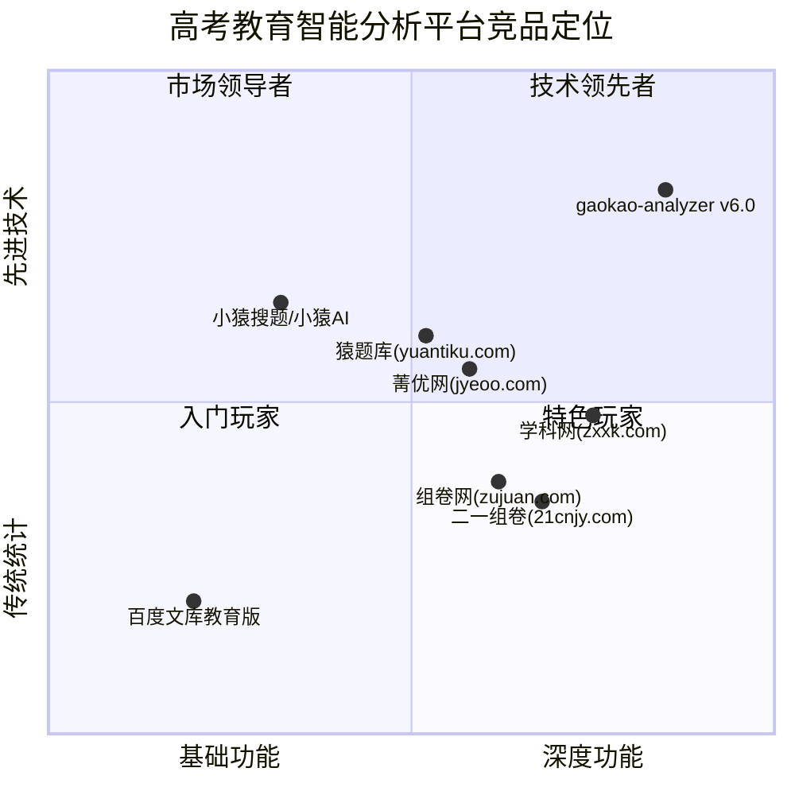

# gaokao-analyzer v6.0 产品需求文档（PRD）

> **产品经理**：许清楚（Xu）  
> **项目名称**：gaokao-analyzer  
> **版本**：v6.0（大版本重构）  
> **语言**：中文  
> **编程语言**：Python 3.13+（FastAPI 后端）/ Vite + React + MUI + Tailwind CSS（前端）  
> **数据库**：PostgreSQL（主库）/ SQLite（本地开发退路）  
> **原始需求**：基于 v5.1（IRT 3PL 引擎 + 多源采集 + 6 维质量分析 + JWT/RBAC 鉴权），重构为以 **题型分类 → 质量诊断 → 智能组卷 → 错题库** 为核心链路的下一代高考模拟卷智能分析系统。

---

## 一、竞品分析（核心）

### 1.1 竞品全景总览

| 竞品 | 类型 | 题库规模（估） | 核心能力 | 组卷方式 | 错题本 | IRT/CTI 分析 | 技术开放性 |
|------|------|---------------|----------|---------|-------|-------------|-----------|
| **学科网（zxxk.com）** | 教育资源平台 | 5000万+ | 资源库+组卷+阅卷+学情 | 按章节/难度/题型多维度筛选，AI 3秒成卷 | ✅ 有（个性化错题专练） | ❌ 未见 IRT；统计报表为主 | API/SaaS/OAuth 合作，闭源 |
| **组卷网（zujuan.com）** | 题库组卷平台 | 2000万+ | 组卷 + 校本题库 + 联考 | 智能组卷+一键AB卷+细目表 | ❌ 无独立错题本 | ❌ 无 IRT；简单难度标签 | 闭源，无公开 API |
| **菁优网（jyeoo.com）** | AI 组卷备课平台 | 2500万+ | 拍照答疑+组卷+AI 工具 | 拖拽选题+智能组卷+AI 试卷擦除 | ✅ 有（错题收录+同类推荐） | ❌ CV视觉+NLP解析，无 IRT | 闭源，有移动端/网页端 |
| **猿题库（yuantiku.com）** | 在线练习平台 | 1500万+ | 练习+组卷+真题 | 学情薄弱点组卷 | ✅ 有（智能错题本） | ⚠️ 可能有 IRT（推断）；未公开 | 闭源，教师版/学生版 |
| **小猿搜题（现小猿AI）** | 拍照搜题App | 海量（依赖集团题库） | 拍照搜题+作业检查+AI | 无独立组卷功能 | ✅ 有（拍照错题收录） | ❌ 视觉识别为主 | 闭源，移动端为主 |
| **百度文库教育版** | 文档资源平台 | 数亿文档 | 资源下载+基础题库 | 无独立组卷 | ❌ 无 | ❌ | 闭源，文档格式为主 |
| **二一组卷（21cnjy.com）** | 组卷平台 | 1800万+ | 组卷+阅卷+校本题库 | 智能组卷+AB卷+分层卷+细目表 | ⚠️ 通过阅卷系统间接支持 | ❌ 无 IRT | 闭源，免费版可用 |

### 1.2 核心竞品深度分析

#### 1.2.1 学科网（组卷模块）

**推测架构**：
- 传统关系型数据库（MySQL/阿里云 RDS）+ 自建全文搜索引擎
- 题库按学科/教材版本/章节/题型 4 级树形结构组织
- 组卷算法：基于标签匹配的贪心+约束满足（无 IRT 能力支撑）
- 前后端分离架构（React/Vue），SaaS 多租户

**功能实现层次**：
- **题型分类**：✅ 按题型标签过滤，依赖人工标注，准确率 >90%
- **质量诊断**：⚠️ 仅有难度系数（做题统计）、使用频次等基础统计标签，无 IRT/CTT 多维诊断
- **智能组卷**：✅ 支持多维度筛选+AI 3秒成卷（推测是基于大模型的自然语言组卷指令）
- **错题库**：✅ 有（个性化错题专练），但错题分析限于统计层面，无知识图谱薄弱点诊断

**性能瓶颈与短板**：
1. **无心理测量学基础**：整个体系基于经典统计（CTT），缺乏 IRT 项目参数校准，对试题质量的评估停留在"多少人做对了"层面
2. **组卷缺少优化目标**：标签匹配组卷不考虑试卷整体的信度/效度/区分度等测量学指标
3. **数据孤岛**：学科网/组卷网各自独立，错题数据、组卷数据、学情数据未打通形成闭环
4. **校本题库手动标注**：教师需要手动标考点，无自动知识点提取
5. **封闭生态**：虽提供 API，但核心算法不开放，无法二次开发

**与 gaokao-analyzer 差异**：
- gaokao-analyzer 拥有 IRT 3PL/GPCM/GRM 引擎，这是学科网完全没有的
- gaokao-analyzer 开源可自建，学科网 SaaS 封闭
- gaokao-analyzer 的蒙特卡洛模拟+偏态校准针对高考真实分布

#### 1.2.2 组卷网

**推测架构**：
- 与学科网共享底层题库（同属北京科技股份有限公司）
- 组卷引擎独立部署，WebSocket 实时预览
- 支持 LaTeX/MathJax 公式渲染

**短板**：
1. 组卷约束条件不够精细（不能按区分度/猜测参数筛选）
2. 生成试卷后无批量质量预检报告
3. 不支持 CTT+IRT 混合质量评估
4. 学生端功能薄弱，主要是教师工具

#### 1.2.3 菁优网

**亮点**：
- CV 视觉引擎支持手写体 OCR/公式识别（拍照搜题）
- NLP 深度解析实现解题逻辑可解释性拆解
- AI 试卷擦除功能（清除手写笔迹还原空白卷）
- 250 万+试卷库

**短板**：
1. 理科强文科弱：数理化资源丰富，语文/英语/政史地资源明显不足
2. 无校本题库批量导入功能
3. 分层组卷/AB 卷需付费解锁
4. 无 IRT 质量分析
5. 手动操作耗时（分层组卷约 120 分钟）

#### 1.2.4 猿题库

**亮点**：
- 真题更新快，1500 万+试题
- 支持根据学情薄弱点组卷
- 错题本与练习推荐联动

**短板**：
1. 校本题库功能弱
2. 生成的试卷排版需二次调整（15 分钟额外工时）
3. 无 AB 卷自动生成
4. 无批量试卷分析/质量报告
5. 偏向学生端，教师工具深度不足

#### 1.2.5 百度文库教育版

**短板显著**：
1. 非结构化数据为主（Word/PDF 文档），无标准化题库
2. 无组卷功能
3. 无错题本
4. 无任何教育测量分析
5. 优势仅在内容数量，不在质量

#### 1.2.6 二一组卷

**亮点**：
- 8 分钟生成可打印试卷（应急场景最强）
- 一键 AB 卷 + 答题卡 + 评分标准
- 校本题库支持 Word/PDF 批量导入

**短板**：
1. 校本题库考点需手动标注，无自动功能
2. 分层卷需手动复制调整，非一键生成
3. 无 IRT 质量分析
4. 无错题本功能（通过阅卷系统间接支持）

### 1.3 竞品定位象限图



**象限解释**：
- **x 轴（功能深度）**：从基础资源展示到多维度分析+智能组卷+错题闭环的综合能力
- **y 轴（技术先进性）**：从传统统计标签到 IRT 心理测量+AI+蒙特卡洛模拟的先进技术栈
- **gaokao-analyzer v6.0 定位**：右上角"技术领先+深度功能"区，在技术和功能两个维度均领先竞品

---

## 二、市场定位

### 2.1 差异化定位

> **"高考教育领域的开源心理测量引擎 + 智能组卷平台"**

gaokao-analyzer v6.0 不与学科网/组卷网在资源数量上正面竞争（我们的资源采集能力远不如商业平台），而是从 **测量学质量** 和 **算法深度** 两个维度建立壁垒：

| 维度 | 竞品现状 | gaokao-analyzer 差异化 |
|------|---------|----------------------|
| 质量评估基础 | CTT 经典统计（正确率/使用频次） | IRT 3PL/GPCM/GRM 心理测量模型 |
| 组卷优化目标 | 标签匹配 + 工作量最小化 | 多目标优化（信度/效度/区分度/难度/知识点覆盖） |
| 诊断维度 | 1-2 维（难度/使用频率） | 6 维（难度+区分度+信度+效度+知识点+题型分布） |
| 数据校准 | 无 | 蒙特卡洛模拟 + 高考真实偏态分布校准 |
| 错题分析 | 统计层面（错题次数） | 知识图谱薄弱点诊断 + IRT 能力水平估计 |
| 开放性 | 闭源 SaaS | 开源（MIT 协议），可私有部署 |
| 架构 | 单体 SaaS | 模块化设计（可嵌入/可扩展/可定制） |

### 2.2 核心竞争优势

1. **心理测量学引擎壁垒**：已实现 3PL/GPCM/GRM 三种 IRT 模型 + Numba JIT 加速 + 拟合指数（CFI/TLI/RMSEA），这是竞品短期内难以复制的技术门槛
2. **高考数据校准**：基于教育部公开统计数据+蒙特卡洛模拟实现偏态校准，贴近真实高考分数分布
3. **开源 + 可自建**：可私有化部署，适用于教育机构/学校对数据隐私有要求的场景
4. **模块化架构**：题型分类→质量诊断→智能组卷→错题库，每一层可独立使用或替换
5. **CT考试适配**：已适配"3+1+2"新高考模式，覆盖全部 9 个学科

### 2.3 目标用户

| 用户角色 | 核心需求 | 使用场景 | 付费意愿 |
|---------|---------|---------|---------|
| **高考学生** | 智能组卷练习+薄弱点诊断+错题同类推荐 | 课后自主练习、考前冲刺 | 中（愿意为提分付费） |
| **一线教师** | 快速组卷+质量预检+学情分析 | 日常考试/作业出题、考后分析 | 高（提升工作效率） |
| **教研员/命题组** | 试卷质量评估+命题科学化+题库管理 | 联考命题、质量监控 | 高（专业需求） |

---

## 三、产品目标（v6.0）

### Goal 1：题型自动分类与质量诊断体系

构建覆盖 9 大学科的题型智能分类引擎，建立基于 IRT+CTT 混合模型的 6 维质量诊断体系，让每一道题和每一份试卷都有可量化的质量标签。

### Goal 2：约束驱动的智能组卷引擎

将组卷问题建模为**多目标约束优化问题**，支持按知识点分布、难度梯度、区分度区间、题型比例等多维约束自动生成试卷，并预输出整卷质量报告。

### Goal 3：学生错题闭环管理

实现错题自动收录 → 按学科/知识点/题型分类 → 统计分析 → 薄弱知识点诊断 → 同类题智能推荐的完整闭环，帮助学生高效提分。

### Goal 4：架构现代化与数据层重构

从 SQLite 正式切到 PostgreSQL 为主库，重构数据层（repository 模式），保留 SQLite 为本地开发退路，确保 v6.0 可承载校园级并发（千人规模）。

### Goal 5：三端融合体验

在前端实现学生/教师/教研员三种角色的差异化工作台，打通"采卷→分析→组卷→练习→诊断"全链路交互。

---

## 四、用户故事

### 4.1 学生角色

| ID | User Story | 优先级 |
|----|-----------|--------|
| US-S-01 | 作为一名高三学生，我希望上传做过的试卷/截图，系统能自动识别题型并分析每道题的质量（难度/区分度），以便我了解这份卷子的"含金量" | P0 |
| US-S-02 | 作为一名高三学生，我希望系统能根据我的薄弱知识点和当前水平，智能生成一套专项训练卷，以便我集中攻破弱项 | P1 |
| US-S-03 | 作为一名高三学生，我希望系统能自动收录我做错的题并分类管理，定期推送同类错题推荐练习，以便我不再犯同类错误 | P2 |
| US-S-04 | 作为一名高三学生，我希望查看我的能力变化趋势图（IRT θ 值随时间的波动），以便量化评估复习效果 | P1 |
| US-S-05 | 作为一名高三学生，我希望能按"真题优先"原则组卷，优先使用近年高考真题，以便更贴近真实考试 | P1 |

### 4.2 教师角色

| ID | User Story | 优先级 |
|----|-----------|--------|
| US-T-01 | 作为一名高三数学教师，我希望选择知识点、难度梯度、题型比例等约束条件，一键生成一份符合高考标准的模拟卷，以便节省出题时间 | P1 |
| US-T-02 | 作为一名高三教师，我希望在组卷完成后立即看到整卷的质量预检报告（难度曲线/区分度/信度/知识点覆盖），以便在打印前调优试卷 | P0 |
| US-T-03 | 作为一名高三教师，我希望查看全班学生的错题汇总分析，找出共性薄弱知识点，以便调整教学重点 | P2 |
| US-T-04 | 作为一名高三教师，我希望手动微调已生成的试卷（替换某道题、调整顺序、修改分值），以便在智能组卷基础上保留教师专业判断 | P1 |
| US-T-05 | 作为一名高三教师，我希望对组卷方案进行"存为模板"操作，以便下次同类考试快速复用 | P2 |

### 4.3 教研员角色

| ID | User Story | 优先级 |
|----|-----------|--------|
| US-R-01 | 作为一名教研员，我希望选择多份试卷进行批量分析，自动生成横向对比报告（各卷难度分布/质量评分排名），以便客观评价命题质量 | P0 |
| US-R-02 | 作为一名教研员，我希望审查每道题的 IRT 参数（区分度 a / 难度 b / 猜测参数 c），判断该题是否适合纳入联考命题库 | P0 |
| US-R-03 | 作为一名教研员，我希望能按来源（学科网/组卷网/菁优网等）对比相同知识点的试题差异，以便在不同教辅材料间做质量比较 | P1 |
| US-R-04 | 作为一名教研员，我希望系统能分析历年高考真题的命题趋势（知识点权重变化/难度波动/题型演变），以便指导复习方向 | P2 |

---

## 五、需求池（P0/P1/P2）

### 5.1 优先级说明

| 优先级 | 含义 | 交付标准 |
|--------|------|---------|
| **P0** | Must have（必须有） | v6.0 发布阻塞项，缺失则版本不可发布 |
| **P1** | Should have（应该有） | v6.0 核心功能，缺失会大幅降低产品价值 |
| **P2** | Nice to have（最好有） | v6.0 扩展功能，可延至 v6.1 |

### 5.2 需求清单

| ID | 模块 | 需求描述 | 优先级 | 依赖 |
|----|------|---------|--------|------|
| **RQ-01** | 题型分类 | 实现题型自动分类引擎：选择题（单选/多选）、填空题、解答题（简答/证明/计算）、综合题，支持 9 大学科 | **P0** | 数据层重构（RQ-05） |
| **RQ-02** | 题型分类 | 按学科建立独立题型库，每道题标记其题型+子类型+科目 | **P0** | RQ-01 |
| **RQ-03** | 质量诊断 | 设计题型质量评估指标体系（难度/区分度/知识点覆盖度/信度/效度/猜测参数） | **P0** | RQ-01, IRT 引擎（已有） |
| **RQ-04** | 质量诊断 | 提供质量诊断可视化报告（6 维雷达图 + 单项评分 + 改进建议） | **P0** | RQ-03 |
| **RQ-05** | 数据层重构 | 切换 PostgreSQL 为主库，重构 repository 层，SQLite 保留为本地退路 | **P0** | 无 |
| **RQ-06** | 质量诊断 | IRT + CTT 混合质量诊断模型（对每个题型同时输出 CTT 指标和 IRT 参数） | **P0** | RQ-03, IRT 引擎 |
| **RQ-07** | 智能组卷 | 基于约束规则引擎的自动组卷（知识点分布/难度梯度/题型比例/区分度区间） | **P1** | RQ-01, RQ-02, RQ-03 |
| **RQ-08** | 智能组卷 | 组卷结果质量预检报告（整卷难度曲线/信度估计/区分度分布/知识点覆盖率） | **P1** | RQ-07, RQ-03 |
| **RQ-09** | 智能组卷 | 教师手动微调（换题/调序/改分）+ 一键预览/导出试卷（PDF/Word） | **P1** | RQ-07 |
| **RQ-10** | 智能组卷 | 组卷模板管理（保存/加载/分享组卷方案） | **P2** | RQ-07 |
| **RQ-11** | 智能组卷 | 真题优先策略：组卷时优先选用近年高考真题 | **P1** | RQ-07 |
| **RQ-12** | 智能组卷 | AI 辅助组卷（自然语言描述组卷需求，如"来一份数学中档题，偏导数"） | **P2** | RQ-07, LLM 集成 |
| **RQ-13** | 错题库 | 学生错题自动收录（手动录入/拍照上传/组卷练习自动标记） | **P2** | 用户系统（已有） |
| **RQ-14** | 错题库 | 错题分类管理（按学科/知识点/题型/错误原因分类） | **P2** | RQ-13 |
| **RQ-15** | 错题库 | 错题统计分析仪表盘（错题总数/薄弱知识点排名/能力雷达图） | **P2** | RQ-14 |
| **RQ-16** | 错题库 | 薄弱知识点诊断（基于 IRT θ 值估计 + 知识图谱缺失分析） | **P2** | RQ-15, IRT 引擎 |
| **RQ-17** | 错题库 | 同类错题智能推荐（基于知识点 + IRT 参数的相似题匹配） | **P2** | RQ-16, RQ-07 |
| **RQ-18** | 前端重构 | 学生工作台（个人中心/练习记录/能力趋势/错题本） | **P1** | 各后端模块 |
| **RQ-19** | 前端重构 | 教师工作台（组卷面板/班级管理/作业布置/学情概览） | **P1** | 各后端模块 |
| **RQ-20** | 前端重构 | 教研员工作台（批量分析/质量对比/命题趋势/题库管理） | **P1** | 各后端模块 |
| **RQ-21** | 数据迁移 | v5.1 存量数据（papers/questions/reports）迁移到 PostgreSQL | **P0** | RQ-05 |
| **RQ-22** | 系统监控 | 组卷任务异步化（Celery）+ 进度推送（WebSocket） | **P1** | RQ-07, Celery（已有） |

---

## 六、UI 设计草案

### 6.1 整体布局

采用 MUI 侧边栏导航布局（延续 v5.x 设计语言），左侧为角色切换 + 导航菜单，右侧为主体工作区。

```
┌─────────────────────────────────────────────────────────┐
│  [Logo] gaokao-analyzer v6          [角色切换] [语言] [用户] │
├──────────┬──────────────────────────────────────────────┤
│  🎯 首页  │                                              │
│  📋 题库  │             主工作区                           │
│  🔬 分析  │         （页面级内容区域）                      │
│  📝 组卷  │                                              │
│  📚 错题  │                                              │
│  📊 报表  │                                              │
│  ⚙️ 设置  │                                              │
└──────────┴──────────────────────────────────────────────┘
```

### 6.2 关键页面设计

#### 6.2.1 题型分类与质量诊断页（P0）

**布局**：
- 顶部标签栏：按学科（数学/语文/英语...）切换
- 左侧：题型树形目录（选择题/填空题/解答题 → 子类型）
- 右侧上部：选中题型的质量雷达图（6 维指标）
- 右侧下部：该题型下试题列表（表格展示：题号/内容/难度系数/区分度/IRT-a/IRT-b/IRT-c/操作）

**交互**：
1. 默认展示所有学科的题型概览统计（各题型数量占比饼图）
2. 点击某题型 → 展示该题型质量分布直方图
3. 点击某道题 → 弹出详情面板（题目原文 + 完整 IRT 参数 + CTT 指标）

#### 6.2.2 智能组卷页（P1）

**布局**：

```
┌──────────────────────────────────────────────────────────────────┐
│ 📝 智能组卷                                                       │
├──────────────────────────────────────────────────────────────────┤
│ ┌──约束条件面板─────────────────────────────────────────────────┐ │
│ │ 📐 学科：数学      📄 题型：[✓选择 ✓填空 ✓解答]              │ │
│ │ 📊 难度梯度：基础 30% ｜ 中等 45% ｜ 困难 25%                 │ │
│ │ 📚 知识点：[函数(15分) ｜ 导数(12分) ｜ 概率(10分)...]        │ │
│ │ 📏 题量：22 题     ⏱ 预估用时：120 分钟                       │ │
│ │ [🔍 保存为模板]  [🤖 AI 辅助组卷]  [✨ 一键生成]              │ │
│ └──────────────────────────────────────────────────────────────┘ │
│                                                                  │
│ ┌──组卷结果预览（根据约束实时生成）──────────────────────────────┐ │
│ │ 第1页 预览区（与最终排版一致）                                  │ │
│ │ ┌─────────────────────────────────────────────────────────┐   │ │
│ │ │ 一、选择题（每题5分，共40分）                             │   │ │
│ │ │ 1. 已知函数f(x)=...                                       │   │ │
│ │ │    A. 2   B. 4   C. 6   D. 8                              │   │ │
│ │ │ 2. ...                                                 │   │ │
│ │ └─────────────────────────────────────────────────────────┘   │ │
│ │ [换题] [调序] [改分值] [导出 PDF] [导出 Word] [存为模板]      │ │
│ └──────────────────────────────────────────────────────────────┘ │
│                                                                  │
│ ┌──质量预检报告──────────────────────────────────────────────────┐ │
│ │ 📊 综合质量分：86/100                                        │ │
│ │ ┌──────┬──────┬──────┬──────┬──────┬──────┐                │ │
│ │ │ 难度 │区分度 │ 信度 │ 效度 │知识点│题型  │                │ │
│ │ │ 0.62 │ 0.58 │ 0.85 │ 0.78 │ 92%  │匹配度│                │ │
│ │ ├──────┴──────┴──────┴──────┴──────┴──────┤                │ │
│ │ │ 📈 难度分布曲线（对比目标 vs 实际）        │                │ │
│ │ │ ⚠️ 建议：知识点"数列"覆盖不足(3%)，建议补充  │                │ │
│ │ └─────────────────────────────────────────────┘                │ │
│ └──────────────────────────────────────────────────────────────┘ │
└──────────────────────────────────────────────────────────────────┘
```

**交互流程**：
1. 教师设置约束条件 → 点击"一键生成"
2. 系统后台运行约束规则引擎（异步任务）→ 实时回传进度
3. 结果预览区展示试卷 + 质量预检报告
4. 教师可逐题替换（点击某题 → 从备选题库中选择）
5. 确认满意后 → 导出或存为模板

#### 6.2.3 错题库页（P2）

**布局**：
- 顶部：学科过滤 + 时间范围 + 错误原因（概念不清/粗心/计算失误）
- 左侧：知识点薄弱排行（按错误率降序，颜色标记严重程度）
- 右侧上部：错题列表（题号/内容/错误次数/最后错误时间/操作）
- 右侧下部：选中错题的详情 + 3 道同类推荐题目

**交互**：
1. 默认展示本周新增错题
2. 点击知识点节点 → 筛选该知识点下所有错题
3. 点击"同类推荐" → 基于知识点+IRT 参数匹配的 3-5 道相似题
4. "薄弱诊断"按钮 → 生成个性化诊断报告（IRT θ 值 + 知识图谱）

#### 6.2.4 学生能力趋势页（P1）

- 展示随着时间推移的 IRT θ 值变化折线图（横轴=时间，纵轴=能力值）
- 叠加各科雷达图（展示单科内各维度的能力分布）
- 高考预估分数线参考线（校准后的百分位对应）

#### 6.2.5 批量分析对比页（P0, 教研员）

- 多份试卷的横向对比表格（质量分/难度/区分度/信度/效度排序）
- 一键导出对比报告（PDF）
- 散点图：各试卷在"难度-区分度"平面的分布

---

## 七、开放问题（需决策）

| # | 问题 | 建议方案 | 需要谁决策 |
|---|------|---------|-----------|
| Q1 | **题型分类引擎的技术路线**：选用规则引擎 + NLP 分类器（传统 ML）还是引入大模型（LLM）做端到端分类？ | v6.0 建议用规则引擎（基于题型特征模板）+ LightGBM 分类器作为 P0；LLM 方案留作 P2 增强 | 架构师 + 算法负责人 |
| Q2 | **组卷约束规则引擎的实现**：用现成的约束求解器（如 OR-Tools / Z3），还是自研贪心 + 局部搜索算法？ | OR-Tools CP-SAT 求解器适合多约束问题，建议 P1 先用 OR-Tools，后续自研优化 | 架构师 |
| Q3 | **IRT 参数估计的实时性**：v5.x 的 IRT 参数估计需要 5 秒（Numba JIT），组卷场景下能否接受？是否需要对参数做预计算缓存？ | 建议 P0 做 IRT 参数预计算 + 定期增量更新，组卷时直接读取缓存，<100ms | 架构师 |
| Q4 | **错题库数据隐私**：学生错题数据是否需要脱敏存储？是否支持班级/学校级数据隔离？ | 建议引入 tenant_id 实现多租户隔离，PostgreSQL 行级安全策略（RLS） | 安全负责人 |
| Q5 | **PostgreSQL 迁移方案**：v5.x 存量数据（可能已有数百份试卷 + 分析报告）如何平滑迁移？ | 建议开发迁移脚本工具（CLI），支持增量迁移和回滚 | 架构师 |
| Q6 | **导出格式**：试卷导出支持哪些格式？PDF vs Word（docx）vs LaTeX？ | P1 先做 PDF（html2pdf），P2 加 Word（python-docx）和 LaTeX 模板 | 产品经理（我）+ 架构师 |
| Q7 | **是否保留与学科网/组卷网的采集适配器**：v6.0 是否继续支持从竞品平台采集数据？（法律/合规风险） | 建议保留技术适配器但默认关闭，用户自行决定是否启用 | 法务 + 主理人 |
| Q8 | **移动端适配优先级**：是优先做响应式 Web，还是做独立小程序/App？ | v6.0 做 PWA 增强（已有基础），移动端原生 App 延至 v7.0 | 主理人 |
| Q9 | **AI 组卷的自然语言指令支持**：是否集成大模型解析教师自然语言指令（如"来一份偏导数中档题"）？ | P2 功能，需要额外集成 LLM API（DeepSeek 已有），建议不抢占 P0/P1 资源 | 主理人 |
| Q10 | **定价与商业模式**：开源项目如何可持续发展？社区版 vs 企业版的边界？ | 建议 MIT 开源社区版 + 企业版增值服务（私有部署/技术支持/定制开发） | 主理人 |

---

## 八、技术约束与前提

### 8.1 架构前提

- **数据库**：PostgreSQL（主库）+ SQLite（本地开发退路）
- **技术栈**：FastAPI + React/MUI + ECharts（延续 v5.x，不引入全新框架）
- **消息队列**：Celery + Redis broker（已有，用于异步组卷任务）
- **搜索引擎**：Meilisearch（已有，用于题库搜索）
- **缓存**：Redis L2 缓存（已有）
- **IRT 引擎**：已有 3PL/GPCM/GRM 模型 + Numba JIT 加速

### 8.2 模块依赖关系

```
题型分类 (P0)  ←── 质量诊断 (P0)  ←── 智能组卷 (P1)  ←── 错题库 (P2)
    │                   │                    │                  │
    │                   ▼                    ▼                  ▼
    └──────────→  题型库（按学科独立） ←── 约束规则引擎  ←── 知识图谱
                        │                    │                  │
                        ▼                    ▼                  ▼
                  PostgreSQL 主库 ←── 数据层 Repository ──→ IRT 引擎
```

### 8.3 性能指标（目标）

| 指标 | 当前 v5.x | v6.0 目标 |
|------|-----------|----------|
| 单卷质量分析耗时 | ~5s（IRT 参数估计） | <1s（预热后缓存命中） |
| 智能组卷生成耗时 | 无此功能 | <5s（10 道题约束求解） |
| 错题检索响应 | 无此功能 | <200ms |
| 并发支持 | 单用户 | 校园级（500 人并发） |
| 题库搜索响应 | <100ms（Meilisearch） | <100ms |

---

## 九、附录

### 9.1 竞品信息来源

| 竞品 | 信息来源 |
|------|---------|
| 学科网（zxxk.com） | 官网产品页、公开 API 文档、用户评测 |
| 组卷网（zujuan.com） | 官网、App Store 描述、教育行业报告 |
| 菁优网（jyeoo.com） | 官网、百度百科、教育科技媒体评测 |
| 猿题库（yuantiku.com） | 官网、产品分析报告、教师用户反馈 |
| 小猿搜题 / 小猿AI | 官网（xiaoyuankousuan.com）、应用商店 |
| 百度文库教育版 | 百度文库教育专区 |
| 二一组卷（21cnjy.com） | 搜狐评测文章、《6 大真实平台实测》 |

### 9.2 参考文档

- [v5.1 README](../README.md) — 项目当前功能概览
- [config.py](../config.py) — 配置与数据源定义
- [irt_models.py](../engines/irt_models.py) — IRT 引擎实现
- [analysis_service.py](../services/analysis_service.py) — 分析服务编排
- [models.py](../models.py) — 数据库模型定义

---

*本文档由许清楚（Xu）编写，如有疑问请通过主理人（齐活林）转达。*
